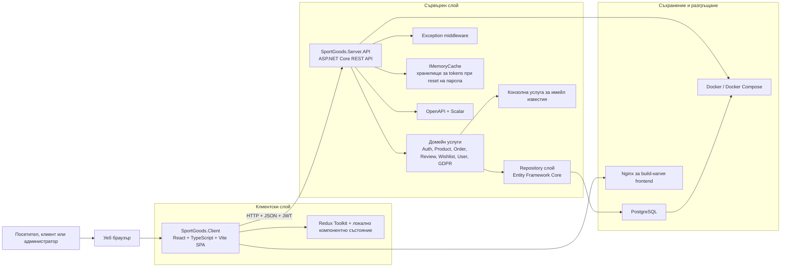
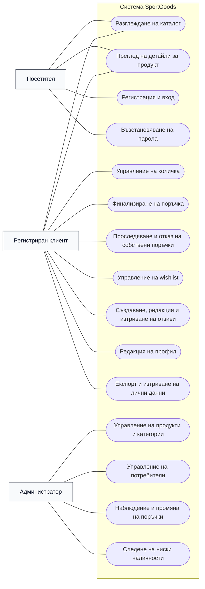
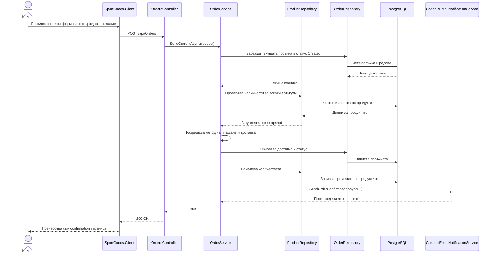
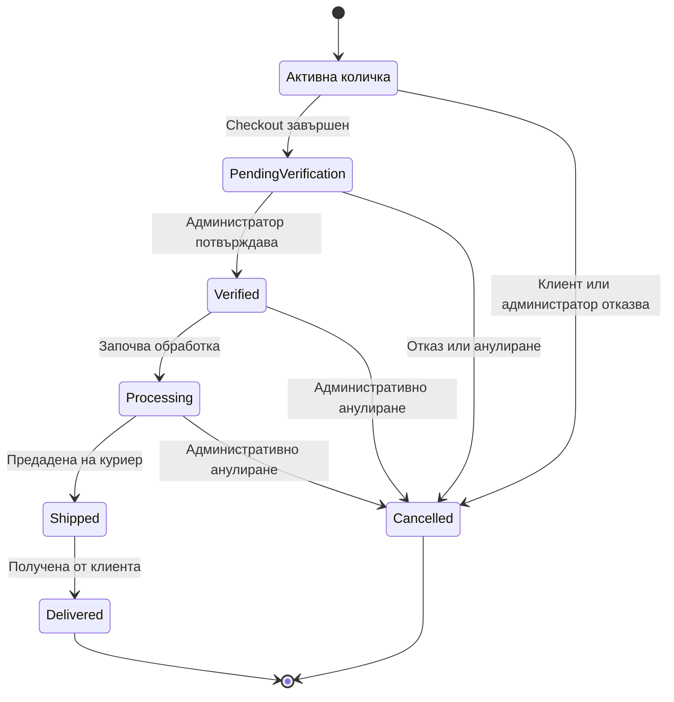
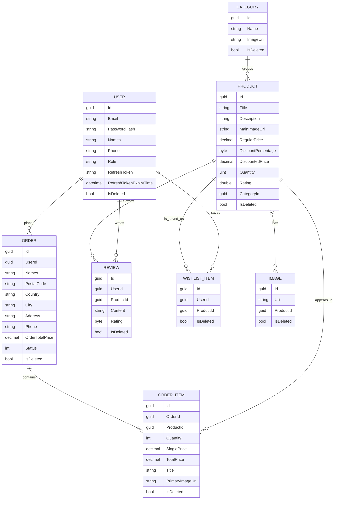

# Заглавна страница

**Име на проекта:** SportGoods  
**Тип на системата:** Уеб базирана система за електронна търговия със спортни стоки  
**Екип и роли:**  
- Алекс Иванов, Team Lead и Backend Developer  
- Калоян Илиев, Frontend Developer, UI/UX Designer и Content Creator  
**Курс:** 3 курс  
**Семестър:** Летен семестър  
**Специалност:** КСТ  
**Група:** 25р  
**Година:** 2026

## 1. Обща характеристика на проекта

SportGoods е университетски софтуерен проект, който реализира завършен онлайн магазин за спортни стоки. Целта на системата не е единствено визуализиране на продукти, а поддръжка на целия основен процес на електронна търговия: публично разглеждане на каталог, регистрация и вход на потребители, работа с количка, завършване на поръчка, проследяване на поръчки, управление на отзиви, списък с любими продукти и административно управление на каталога и поръчките. Реализацията е разделена в две хранилища. `SportGoods.Client` съдържа клиентското едностранично приложение, а `SportGoods.Server` съдържа REST API, домейн услугите, слоя за достъп до данни, конфигурацията и автоматизираните тестове на сървърната част.

Бизнес проблемът, който проектът решава, е необходимостта от структуриран дигитален канал за продажба на спортна екипировка и аксесоари. В традиционен физически магазин или в статичен уеб сайт клиентите често нямат удобен начин да филтрират голям каталог, да сравняват продукти, да проверяват наличности, да запазват артикули за по-късно или да поръчват извън работно време. SportGoods адресира тези ограничения чрез категории, детайлни продуктови страници, автентикирани клиентски действия и административно пространство за оперативно управление.

Реализираната система обслужва три практически потребителски контекста. Първият контекст е публичната витрина, където посетителите могат да отварят началната страница, да разглеждат категории, избрани продукти, да търсят и филтрират каталога и да четат детайлна информация за продуктите. Вторият контекст е зоната за автентикирани клиенти, в която регистрираните потребители могат да поддържат профила си, да добавят артикули в активна количка, да финализират поръчка, да преглеждат историята на поръчките си, да пазят продукти в wishlist, да публикуват отзиви, да експортират личните си данни и да заявяват изтриване на акаунта. Третият контекст е административното работно пространство, в което администраторът следи активността по поръчките, наблюдава продукти с ниска наличност, управлява продукти и категории, поддържа потребители и променя статусите на поръчките.

От функционална гледна точка проектът реализира основните процеси, които се очакват от онлайн магазин със средна сложност. Продуктите принадлежат към категории, поддържат отстъпки и вторични изображения и могат да бъдат филтрирани по заглавие, категория, ценови диапазон и минимален рейтинг. Регистрираните потребители могат да се автентикират чрез JWT базиран достъп, да възстановяват забравена парола, да управляват профилните си данни и да преминават през процеса от чернова на количка до официална поръчка. Поръчките не са моделирани като изолирана checkout форма, а като централен агрегат, който описва и активната количка, и бизнес процеса след финализиране. Именно това прави домейн модела последователен и подходящ за академичен анализ.

Съществена сила на проекта е, че остава реалистичен и не твърди, че реализира инфраструктура, която реално липсва. Изборът на метод на плащане е моделиран като конфигурируем приложен процес и е визуализиран в checkout потока, но проектът не претендира за жива интеграция с външен банков или картов оператор. По същия начин потвържденията за поръчки и съобщенията за възстановяване на парола се изпращат чрез конзолна услуга за известия, а не чрез реален SMTP или облачен имейл доставчик. Това е коректно инженерно решение за университетски проект, защото запазва приложната логика, без да въвежда външни зависимости, които не са свързани с учебната цел.

Текущата кодова база включва и готов за демонстрация набор от данни. Логиката за seed зарежда базата с 8 категории, 14 продукта, 11 потребители, включително един администратор, 12 примерни поръчки в различни статуси, 18 отзива и 6 записи в списъка с желания. Това е важно за защитата на проекта, защото позволява системата да бъде демонстрирана с реалистично съдържание, а не с празни екрани или само с временни placeholders.

От академична гледна точка SportGoods е добър обект за анализ, защото комбинира потребителска автентикация, ролево базирана авторизация, релационно моделиране на данни, слоеста backend архитектура, модерно SPA клиентско приложение, миграции на база данни, автоматизирани backend тестове и подготовка за контейнеризирано разгръщане. Проектът е достатъчно богат, за да показва реални архитектурни решения, но и достатъчно компактен, за да може да бъде защитен ясно и аргументирано.

## 2. Архитектура на системата

SportGoods следва клиент-сървър архитектура с ясно слоеста backend организация и компонентно организиран frontend. Браузърът зарежда React приложение, React приложението комуникира с ASP.NET Core REST API чрез HTTP и JSON, API делегира бизнес логиката към домейн услуги, а слойът за съхранение записва състоянието в PostgreSQL чрез Entity Framework Core. Това разделение се вижда както в структурата на хранилищата, така и в проектното оформление на server решението и в runtime конфигурацията, която се зарежда при стартиране.

### 2.1 Структура на хранилищата и отговорности

Двете хранилища имат допълващи се отговорности.

- `SportGoods.Client` съдържа визуалната витрина и административния интерфейс.
- `SportGoods.Server` съдържа API, домейн правилата, entity модела, repository слоя и unit тестовете.

Backend хранилището е разделено и на няколко .NET проекта. `SportGoods.Server.API` съдържа контролери, middleware, startup логика и инфраструктурни услуги. `SportGoods.Server.Domain` съдържа бизнес услуги като `AuthService`, `ProductService`, `OrderService`, `ReviewService`, `WishlistService`, `UserService` и `GdprService`. `SportGoods.Server.Data` съдържа `ApplicationDbContext`, entity класовете, repository класовете, helper-и за филтриране, миграциите и seed логиката. `SportGoods.Server.Common` съдържа request и response DTO модели и strongly typed option класове. `SportGoods.Server.Core` съдържа enum типове, споделени стойности, paging helper-и и типове изключения. Тази структура демонстрира съзнателен слоест дизайн, а не controller-heavy монолит.

### 2.2 Frontend приложение

Frontend частта е реализирана с React 18, TypeScript и Vite. Маршрутизацията е дефинирана в `App.tsx` чрез `react-router-dom`, а страниците са организирани в публични страници, клиентски страници за автентикирани потребители и административни страници. Реализираните публични страници включват `Home`, `Products`, `ProductDetails`, `About`, `Login`, `Register`, `ForgotPassword` и `ResetPassword`. Клиентските страници включват `Cart`, `Checkout`, `CheckoutConfirmation`, `Orders`, `Wishlist` и `Profile`. Административната функционалност е групирана под `AdminPanel` и включва `AdminOverview`, `Products`, `Categories`, `Users` и `AdminOrders`.

Стилизирането е реализирано основно чрез Tailwind CSS, с последователен визуален език между витрината и административното пространство. Известията към потребителя се визуализират чрез `react-toastify`, а богати продуктови описания се редактират и визуализират с `react-quill`. Споделеното клиентско състояние се поддържа с Redux Toolkit slices за автентикация, cart информация и user-свързани данни. Състоянието на автентикацията се пази и в `localStorage`, което позволява възстановяване на текущата сесия след refresh на страницата. Успоредно с това frontend приложението остава разбираемо, защото използва основно локално page-level състояние за филтри, таблици, форми и loading индикации.

Frontend частта комуникира с backend чрез `fetch` заявки към базов адрес, зададен чрез `VITE_API_URL`. Към момента няма отделен client-side API слой. Страниците извикват крайните точки директно. За текущия мащаб на проекта това е разумен компромис. Така потокът на данните остава прозрачен в учебен контекст и е лесно да се проследи кои backend крайни точки захранват отделните екрани.

### 2.3 Backend API и слоести услуги

Backend частта е реализирана с ASP.NET Core Web API и в текущите проектни файлове е насочена към `net10.0`. Контролерите публикуват REST крайни точки под `/api`, но умишлено остават тънки. Тяхната основна роля е request binding, деклариране на авторизацията и делегиране към съответната услуга. Примери за това са `AuthController`, `ProductsController`, `OrdersController`, `ReviewsController`, `WishlistController`, `CategoriesController`, `UsersController` и `GdprController`.

Същинската бизнес логика е концентрирана в домейн услугите. `AuthService` обработва регистрация, вход, refresh токени, logout и reset на парола. `OrderService` управлява количката, финализира checkout потока, търсенето на поръчки, промяната на статуси, изчисляването на цени и намаляването на наличности. `ProductService` отговаря за CRUD операции, вторични изображения, търсене на продукти и best-seller логика. `ReviewService` управлява създаване, редакция и изтриване на отзиви и преизчисляване на рейтинга. `WishlistService` поддържа списъка със запазени продукти на клиента. `GdprService` експортира и анонимизира личните данни. `UserService` обработва profile update и административно управление на потребители. Това разпределение на отговорностите прави кодовата база по-лесна за тестване и защита, защото ключовите процеси не са скрити вътре в контролерите.

Repository класовете капсулират логиката за съхранение. Проектът съдържа repository класове за потребители, категории, продукти, изображения, отзиви, поръчки, редове на поръчките и wishlist записи. Тези repository класове работят върху Entity Framework Core entity обекти и се инжектират в домейн услугите чрез интерфейси. Получава се класическа service-plus-repository архитектура, която е подходяща за учебен проект, фокусиран върху слоеве и разделение на отговорностите.

### 2.4 Съхранение на данни и runtime конфигурация

PostgreSQL е реално използваната база данни. Това се потвърждава от `UseNpgsql` регистрацията в `Program.cs`, Npgsql пакетите и backend `docker-compose.yml`, който стартира PostgreSQL 16 контейнер. Entity Framework Core се използва за достъп до базата, миграции, конфигуриране на decimal precision, описване на релациите и начално зареждане на данни. При стартиране API разрешава connection string-а, прилага миграциите автоматично и след това изпълнява seed логиката.

Runtime поведението се управлява чрез strongly typed options. Backend частта bind-ва секции за JWT, client URL, CORS, email поведение, плащания, development настройки и inventory прагове. След това тези настройки се използват от услуги като `AuthService`, `OrderService` и конзолната notification услуга. Практически примери за това са поддържаните методи на плащане, продължителността на password reset токена, прагът за ниска наличност в администраторското табло и development опцията за preview link към reset потока.

### 2.5 Комуникация между слоевете и жизнен цикъл на заявката

Основният request lifecycle в приложението е ясен и лесен за обяснение. Потребителят извършва действие в браузъра, React страницата изпраща HTTP заявка с JSON съдържание, API автентикира и авторизира заявката при нужда, контролерът предава работата към домейн услуга, услугата извършва валидация и операции по съхранение чрез repository слоя и накрая към frontend се връща DTO отговор. Защитените заявки предават `Bearer` токен в `Authorization` header. От сървърната страна `JwtBearer` валидира токена, а `[Authorize]` или `[Authorize(Roles = Roles.Admin)]` ограничават чувствителните операции.

Обработката на грешки е централизирана чрез custom exception middleware. Това е важно за frontend интеграцията, защото клиентът получава предвидими API грешки, а не сурови framework изключения. API-то публикува и OpenAPI метаданни и Scalar страница за интерактивна справка, което прави backend договора по-лесен за преглед по време на разработка и защита.

### 2.6 Диаграма на архитектурата на високо ниво

Диаграмата отразява реалните граници в реализацията. Frontend приложението никога не достъпва директно базата данни. Бизнес поведението принадлежи на backend, а подготовката за разгръщане е представена чрез Docker и Nginx артефактите, които присъстват в хранилищата.

## 3. Функционални модули и UML диаграми

Системата може да бъде разглеждана като набор от сътрудничещи си модули, а не просто като отделни страници. Модулът на публичния каталог покрива откриване и представяне на продукти. Клиентският модул покрива автентикация, количка, checkout, проследяване на поръчки, wishlist, отзиви и поддръжка на профил. Административният модул покрива оперативни функции като управление на каталога, категориите, потребителите и статусите на поръчките. Четвърти cross-cutting модул обработва сигурността, конфигурацията, защитата на личните данни и помощни функции като известия и начални данни.

### 3.1 Use Case диаграма

Use case изгледът показва, че системата не се изчерпва с базово разглеждане и поръчване. Тя включва и lifecycle функционалности около акаунта, действия по защита на личните данни и оперативна администрация. Именно тази ширина на обхвата прави проекта подходящ за академична защита.

### 3.2 Диаграма на последователностите за checkout

Тази диаграма отразява реалния checkout поток в кода. Поръчката се зарежда от вече съществуващата чернова в статус `Created`, наличностите се проверяват преди финализиране, количествата се намаляват едва след валидация, а notification услугата се извиква накрая.

### 3.3 Диаграма на състоянията на поръчката

Този state модел е особено важен, защото SportGoods съзнателно използва един и същ `Order` агрегат едновременно за количка и за финализирана поръчка. Състоянието `Created` представлява черновата на количката, а всички следващи състояния описват оперативната обработка.

## 4. Проектиране на базата данни

Моделът на базата данни е умишлено компактен, но покрива цялото бизнес поведение, необходимо за проекта. Основните entity класове са `User`, `Category`, `Product`, `Image`, `Order`, `OrderItem`, `Review` и `WishlistItem`. Всички те наследяват `GenericEntity`, който добавя автоматично генериран идентификатор, дати на създаване и модификация и флаг за soft delete. Тази обща основа прави модела по-последователен и подпомага по-безопасно изтриване и възстановимост.

`Category` представя горно ниво от каталога и съхранява име и URI към изображение. `Product` е централната каталожна entity структура и пази заглавие, описание, главно изображение, стандартна цена, процент отстъпка, намалена цена, рейтинг, количество и външен ключ към `Category`. Галериите на продуктите се реализират чрез отделната entity `Image`, която сочи към продукт и позволява множество вторични изображения за един артикул.

`User` съхранява имейл, hash на парола, имена, телефон, роля, refresh токен и срок на валидност на refresh токена. Проектът не използва пълния стандартен набор от ASP.NET Identity таблици, а разчита на собствен entity модел плюс `PasswordHasher<User>`. Това прави identity модела по-лесен за обяснение в учебен контекст, като едновременно демонстрира сигурно съхранение на пароли и token-based автентикация.

Моделът на поръчките е по-интересен от стандартна checkout форма с две таблици. `Order` съхранява както собствеността на поръчката, така и данните за доставка като имена, пощенски код, държава, град, адрес, телефон, обща стойност и статус. `OrderItem` пази product reference и snapshot на транзакционните данни: количество, единична цена, обща цена, заглавие и URI на основното изображение. Това snapshot решение е важно, защото запазва визуализацията на поръчката консистентна дори ако по-късно каталогът се промени.

`Review` свързва потребител и продукт и съхранява текстово съдържание и оценка. `WishlistItem` свързва потребители и продукти в лек many-to-many стил. Заедно с GDPR export функционалността тези entity структури показват, че проектът разглежда user-generated съдържанието и личните данни като част от домейн модела, а не като нещо второстепенно.

### 4.1 E-R диаграма

### 4.2 Ключови решения в моделирането на данните

Няколко решения в модела заслужават изрично обяснение, защото са централни за качеството на дизайна.

- Проектът не дефинира отделна `Cart` таблица. `Order` в статус `Created` играе ролята на активна количка.
- Soft delete се прилага върху почти целия модел чрез споделения `IsDeleted` флаг, което подпомага по-безопасно администраторско изтриване и GDPR анонимизация.
- `OrderItem` пази snapshot на продукта, а не само външни ключове и преизчисляване по време на изпълнение. Това запазва историческата консистентност.
- Вторичните изображения на продуктите са нормализирани в отделна таблица, вместо да бъдат пазени в едно текстово поле.
- В `ApplicationDbContext` цените са конфигурирани с изрична decimal precision настройка.

Именно тези решения правят модела по-лесен за разширяване и по-силен от академична гледна точка.

## 5. Етапи на разработка

Точната commit-by-commit хронология не е цел на този документ. Въпреки това текущата структура на хранилищата и реализацията ясно показват реалистична последователност на разработка, която може да бъде реконструирана и защитена.

### 5.1 Планиране и дефиниране на обхвата

Първият етап е бил избор на домейн, който е познат, демонстративен и достатъчно богат за слоеста реализация. Електронната търговия със спортни стоки е подходяща, защото включва каталог, потребителски акаунти, транзакционни потоци и административни операции. Именно на този етап е трябвало да се реши какво влиза в обхвата на проекта и какво остава извън него. Завършената реализация показва съзнателен избор да се покрие целият вътрешен store workflow, като се изключат външни интеграции като продукционен payment gateway и реален email provider.

### 5.2 Анализ на изискванията

Етапът на изискванията е бил фокусиран върху идентифициране на основните user journeys. За клиентите това са разглеждане на каталог, детайли за продукт, регистрация, вход, възстановяване на парола, работа с количка, поръчване, история на поръчки, wishlist, отзиви и поддръжка на профил. За администратора това са управление на продукти, категории, потребители и поръчки. Втора категория изисквания е свързана със сигурност и съответствие, включително hash-ване на пароли, JWT достъп, съгласие при checkout, експорт на лични данни и анонимизация на акаунт. Текущата кодова база показва, че тези теми са били третирани като системни изисквания от началото, а не като последващи добавки.

### 5.3 Проектиране на интерфейс, данни и архитектура

След дефиниране на изискванията те са били трансформирани в софтуерна структура. Това личи от дву-хранилищния setup, multi-project backend решението, релациите между entity класовете и page структурата на frontend приложението. Екипът е проектирал отделни слоеве за контролери, услуги, repository класове, DTO модели и entity класове. От frontend страна страниците са организирани в публични, клиентски и административни маршрути. Моделът на данните е изграден около категории, продукти, изображения, потребители, отзиви, поръчки и wishlist записи, като `Order` умишлено е преизползван като cart агрегат.

### 5.4 Имплементация

Имплементацията е протекла паралелно в двете хранилища. От сървърната страна екипът е реализирал entity класовете, repository слоя, контролерите, услугите, middleware-а, конфигурационните класове, миграциите и seed логиката. От клиентската страна са изградени витрината, списъкът и детайлната страница на продуктите, количката и checkout потокът, клиентските account екрани и административното табло. Доказателство за постепенно обогатяване на системата е разнообразието от функционалности: не само CRUD операции, а и преизчисляване на рейтинги, low-stock предупреждения, preview link за reset на парола, seed-нати примерни поръчки и GDPR export.

### 5.5 Тестване и корекции

Тестването е най-силно застъпено в backend частта. Решението съдържа отделен unit test проект с xUnit, Moq и EF Core InMemory provider. В текущото хранилище присъстват 113 backend теста, които покриват конфигурация, repository класове и service логика за автентикация, категории, продукти, отзиви, поръчки, потребители и wishlist поведение. Това показва, че тестването е било реална инженерна дейност, а не символична последна стъпка. От frontend страна проектът включва Vitest и Testing Library конфигурация, но в `src` не бяха открити project-specific automated тестове. Това следва да бъде признато открито при защитата като зона за бъдещо подобрение.

### 5.6 Подготовка за разгръщане и документация

Последният ясно видим етап е подготовката за възпроизводимо стартиране и академично предаване. И двете хранилища съдържат Docker артефакти. Backend частта може да бъде стартирана заедно с PostgreSQL чрез Docker Compose, а frontend частта може да бъде build-ната и обслужвана чрез Nginx. API прилага миграциите при стартиране и seed-ва базата автоматично, което намалява ръчните стъпки преди демонстрация. Настоящата документация и материалите за защита също принадлежат на този етап, защото академичното завършване изисква не само код, а и структурирано описание на архитектурата, технологиите, потоците и ограниченията.

## 6. Използвани технологии

### 6.1 Backend технологии и аргументация

Backend частта е изградена с .NET и ASP.NET Core Web API. Този стек е избран, защото предоставя зряла основа за REST API, dependency injection, автентикация, middleware и configuration binding. За университетски проект това е особено подходящо, понеже позволява ясно разделение между контролери, услуги и repository класове и едновременно с това е широко използван в реални enterprise среди.

Entity Framework Core е избран като технология за съхранение. Той осигурява миграции, LINQ заявки, описване на релациите и начално зареждане на данни. В контекста на този проект EF Core намалява boilerplate кода и позволява екипът да се фокусира повече върху бизнес правилата, отколкото върху ниско ниво SQL. PostgreSQL е избраната база данни. Тя е подходяща за проекта, защото е стабилна, open-source и добре поддържана чрез Npgsql. Изборът е оправдан както технически, така и учебно, защото показва реален релационен workflow.

Автентикацията е реализирана чрез `Microsoft.AspNetCore.Authentication.JwtBearer`, refresh токени и `PasswordHasher<User>`. Тази комбинация позволява проектът да демонстрира сигурно съхранение на пароли и stateless защита на API-то. Scalar и OpenAPI се използват за инспектируема API документация. `IMemoryCache` служи за временни password reset токени, а проектът включва и custom middleware за централизирана обработка на изключения.

### 6.2 Frontend технологии и аргументация

Frontend частта използва React 18, TypeScript и Vite. React е подходящ, защото приложението съдържа множество преизползваеми UI елементи, отделни изгледи и client-side преходи на състоянието. TypeScript добавя по-силна типизация за API отговори, component props и локални модели. Vite осигурява бърз development цикъл и ясен production build процес, което е особено полезно при студентски проект, който се доработва често.

Маршрутизацията се управлява с `react-router-dom`, което съответства естествено на SPA модела и позволява ясно отделяне между публични и защитени страници. Redux Toolkit се използва за shared state като автентикация, cart информация и user-свързани данни. Tailwind CSS е избран за стилизиране, защото позволява изграждане на пълно responsive UI без голяма отделна CSS кодова база. `react-toastify` осигурява видима обратна връзка при действия като добавяне в количка или грешки при API заявки. `react-quill` се използва там, където продуктови описания се редактират или визуализират като rich text. Заедно тези технологии оформят модерен, но все още разбираем frontend стек.

### 6.3 База данни, разгръщане и управление на средата

PostgreSQL е реално използваната база данни, а Docker и Docker Compose се използват, за да направят проекта по-лесен за локално стартиране и по-възпроизводим при защита. Backend Docker Compose конфигурацията описва API-то и базата данни, докато frontend частта има собствен Dockerfile и олекотена Docker Compose конфигурация за обслужване на build-натото приложение. Nginx се използва за production обслужване на frontend bundle-а. Environment стойностите са отделени в `.env.example` файлове и `appsettings` секции, което е добра практика дори в академична среда, защото избягва hard-code на средово зависима конфигурация.

### 6.4 Инструменти за разработка и качество

Backend качеството се подпомага от xUnit, Moq и EF Core InMemory за unit testing. Frontend качеството се подпомага от ESLint, TypeScript type checking и Vitest конфигурация. Git се използва за version control, а структурата на проекта показва team-based collaboration с ясно разграничени отговорности между хранилищата. Тези инструменти не са добавени формално, а защото реално подпомагат поддръжката, коректността и предвидимото предаване на проекта.

## 7. Качество, сигурност и готовност за демонстрация

### 7.1 Автентикация и авторизация

Системата реализира няколко нива на контрол на достъпа. Паролите се хешират, JWT access токени защитават endpoint-ите, refresh токените позволяват подновяване на сесията, а role-based authorization ограничава административните операции. От frontend страна клиентските страници се пазят чрез `PrivateRoute`, а административното работно пространство проверява ролята на текущия потребител преди визуализация. От backend страна администраторските крайни точки са изрично ограничени чрез role изисквания. Тази комбинация е важна, защото показва, че проектът не разчита единствено на client-side скриване на бутони или маршрути.

### 7.2 Валидация, обработка на грешки и защита на данните

Request DTO моделите дефинират входния договор за операции като checkout, промяна на статус и управление на продукти. Домейн услугите извършват допълнителни проверки, например за наличност преди потвърждаване на поръчка, за duplicate wishlist записи и за преизчисляване на рейтинга след промяна в отзивите. Custom exception middleware преобразува service-level грешките в предвидими API отговори. Изтриването на акаунт е реализирано като анонимизация плюс soft delete, което запазва историята на поръчките, но намалява съхраняваните лични данни. Това е добре защитимо решение за e-commerce домейн.

### 7.3 Текущо състояние на тестването

Backend test suite-ът съдържа 113 автоматизирани теста, разпределени между конфигурация, repository класове и услуги. Това дава на проекта измерима инженерна дълбочина, която надхвърля UI демонстрация и ръчно щракане по екрани. Тестовете са особено ценни около автентикацията, repository поведението и поръчковата логика, където регресиите биха засегнали най-критичните процеси. Честното ограничение е, че frontend частта разполага с подготвен toolchain за тестове, но без реализирани project-specific automated tests. Това не обезсмисля проекта, но трябва да се представя като следваща стъпка за качество, а не да се прикрива.

### 7.4 Готовност за защита и демонстрация

Проектът е добре подготвен за live демонстрация. API-то прилага миграции автоматично, seed логиката зарежда реалистични каталожни и поръчкови данни, административното табло визуализира смислени показатели, а публичната витрина е достатъчно завършена за навигация пред аудитория. Наборът от данни включва продукти с ниска наличност, поръчки в различни статуси, множество категории, клиентски отзиви и privacy функционалности. Това позволява на екипа да покаже едновременно happy-path сценарии и системна дълбочина в рамките на кратка защита.

## 8. Снимки на завършеното решение

За да бъде спазено академичното ограничение от приблизително две страници, документът не трябва да съдържа повече от четири крайни фигури. Препоръчителният подход е 2x2 оформление с кратки надписи. Ако трябва да бъдат показани повече интерфейсни състояния, свързаните екрани трябва да се обединят в колаж в рамките на една фигура, вместо да се добавят допълнителни страници.

1. `[Placeholder за Фигура 1: начална страница с hero секция, входни точки към категории и избрани продукти]`
2. `[Placeholder за Фигура 2: продуктов каталог с филтри, странициране и продуктови карти]`
3. `[Placeholder за Фигура 3: детайлна страница на продукт или checkout поток, показващ прехода от количка към поръчка]`
4. `[Placeholder за Фигура 4: административно работно пространство с overview показатели, low-stock секция и управление на поръчки]`

Ако пространството позволява, профилът и GDPR действията могат да бъдат показани в рамките на Фигура 3 или Фигура 4 като комбиниран колаж, а не като отделна пета снимка.

## 9. Структура на презентацията и защитата

Защитата на проекта трябва да се проведе чрез кратка, техническа и логично подредена презентация. Практична структура от десет слайда е напълно достатъчна.

1. **Слайд 1, заглавие и екип:** Представя проекта, членовете на екипа и разделението в две хранилища. Още тук трябва ясно да се каже, че SportGoods е онлайн магазин за спортни стоки с клиентска и административна функционалност.
2. **Слайд 2, проблем и мотивация:** Обяснява защо е необходим структуриран онлайн канал за продажба и какви ограничения има неструктурираният или чисто физическият процес.
3. **Слайд 3, целеви потребители и реализиран обхват:** Показва трите контекста на работа, посетител, регистриран клиент и администратор, и обобщава реализираните модули.
4. **Слайд 4, архитектура на системата:** Показва клиент-сървър диаграмата и обяснява разделението между React frontend, ASP.NET Core API, домейн услуги, repository слой и PostgreSQL.
5. **Слайд 5, модел на базата данни:** Показва E-R диаграмата и обяснява основните entity структури. Тук задължително трябва да се подчертае решението `Order` в статус `Created` да играе ролята на активна количка.
6. **Слайд 6, основен работен поток:** Използва sequence или state диаграмата, за да обясни checkout процеса и жизнения цикъл на поръчката от количка до доставка или отказ.
7. **Слайд 7, технологии и аргументация:** Обяснява защо са избрани React, TypeScript, ASP.NET Core, EF Core, PostgreSQL, Docker и автоматизирани тестове.
8. **Слайд 8, live demo:** Демонстрира завършен сценарий, например начална страница, детайли за продукт, количка, checkout потвърждение, след което административното табло и промяна на статус на поръчка.
9. **Слайд 9, качество, сигурност и ограничения:** Представя JWT автентикацията, role checks, backend тестовете, GDPR export и анонимизацията, като едновременно с това честно се посочват текущите ограничения.
10. **Слайд 10, заключение:** Обобщава какво е реализирано, защо архитектурата е подходяща и кои са следващите инженерни стъпки.

За разширени бележки към слайдовете виж отделния файл `docs/DefensePresentation.bg.md`.

## 10. Текущи ограничения и бъдещо развитие

Проектът е достатъчно завършен за академично предаване, но не е представян като напълно готов комерсиален продукт. Няколко ограничения се виждат директно в реалната реализация и трябва да бъдат описани ясно.

- Плащането е моделирано като конфигурируем приложен процес, а не като реална външна gateway интеграция.
- Имейл доставката е реализирана чрез конзолна услуга, а не чрез SMTP или cloud mail provider.
- Frontend automated тестове все още не са реализирани, въпреки че toolchain-ът е подготвен.
- В хранилищата няма CI/CD workflow дефиниция.
- Изображенията на продукти и категории се реферират чрез URI адреси, вместо да се качват в отделно file storage решение.

Именно тези ограничения очертават и най-реалистичните следващи стъпки за бъдещо развитие. Първото подобрение би било добавяне на frontend тестове за критичните екрани и потоци. Второто е интеграция на реален email provider и production payment услуга. Третото е добавяне на CI/CD автоматизация и среди за разгръщане. Четвърта логична стъпка е централизиране на frontend API логиката и обработката на refresh токени, така че повтарящите се `fetch` сценарии да бъдат намалени.

## 11. Заключение

SportGoods покрива изискванията за сериозен академичен софтуерен проект. Той предоставя реалистичен домейн, слоеста архитектура, релационен модел на данните, защитени клиентски и административни функционалности, автоматизирани backend тестове и подготовка за разгръщане чрез Docker. Не по-малко важно е, че документацията не преувеличава реализираното. Настоящият текст описва реалната структура на кодовата база и може да бъде защитен като честно инженерно описание на текущата система.
