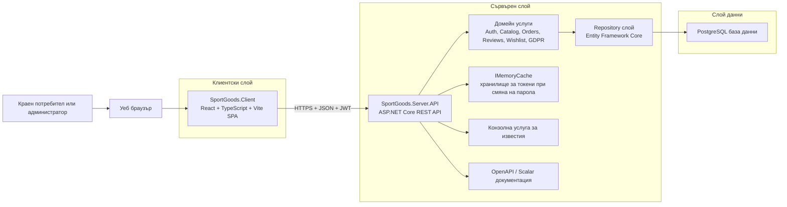
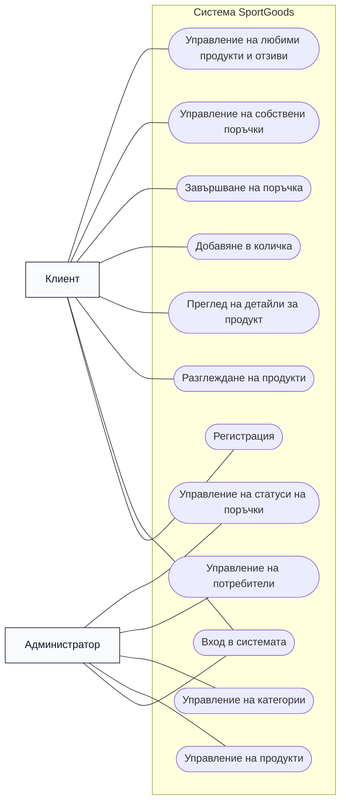
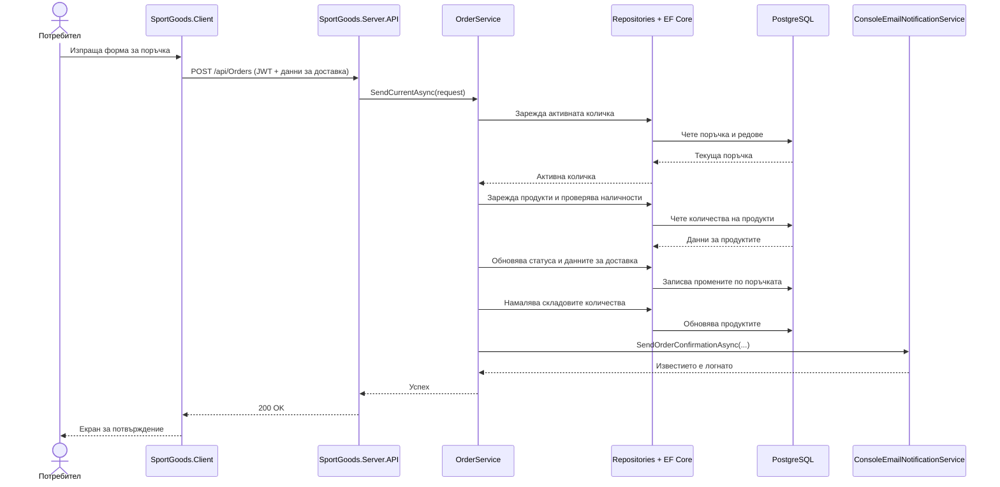
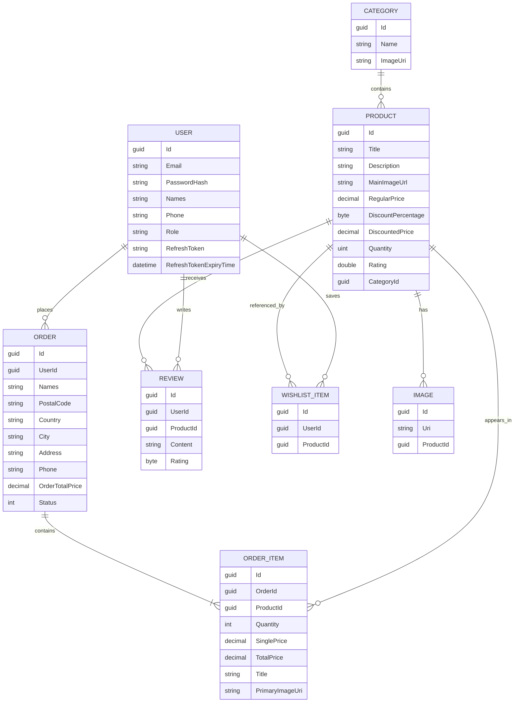

# Заглавна страница

**Име на проекта:** SportGoods  
**Тип на системата:** Система за електронна търговия със спортни стоки  
**Екип и роли:**  
- Алекс Иванов — Team Lead и Backend Developer  
- Калоян Илиев — Frontend Developer, UI/UX Designer и Content Creator  
**Курс:** 3 курс  
**Семестър:** Летен семестър  
**Специалност:** КСТ  
**Група:** 25р  
**Година:** 2026

## 1. Обща характеристика на проекта

SportGoods е интегрирана уеб базирана система за онлайн продажба на спортни стоки. Платформата обединява публичен продуктов каталог, функционалности за автентикирани клиенти, процес по завършване на поръчка и обработка на поръчки, както и административно пространство за управление на каталога и потребителите. Настоящата реализация е разделена в две хранилища: `SportGoods.Client`, което съдържа клиентското едностранично приложение, и `SportGoods.Server`, което съдържа REST API, домейн логиката, слоя за достъп до данни и автоматизираните тестове на сървърната част.

Бизнес проблемът, който системата решава, е необходимостта от структуриран онлайн канал, чрез който спортната екипировка да може да бъде представяна, търсена, филтрирана, поръчвана и администрирана. При традиционен физически магазин или неструктуриран каталог клиентът има ограничени възможности за сравнение на продукти, проверка на наличности, запазване на избрани артикули и финализиране на поръчка в удобен момент. SportGoods решава този проблем чрез организиране на продуктите по категории, детайлни продуктови страници, автентикирано поръчване и ролево базирана административна част за оперативен контрол.

Системата обслужва две основни групи потребители. Първата група са крайните клиенти, които разглеждат магазина, регистрират се, влизат в профила си, управляват личните си данни, добавят артикули в количката, създават поръчки, поддържат списък с любими продукти и публикуват отзиви. Втората група са администраторите, които поддържат продукти, категории, потребители и поръчки чрез специализирани защитени екрани и API крайни точки. Наличието и на двете групи е ясно видимо в кода чрез JWT автентикация, проверки за роли при административни действия и отделни маршрути във frontend приложението за административното табло.

Основните възможности на платформата съответстват на очаквания обхват на онлайн магазин за спортни стоки. Публичната част предоставя начална страница, навигация по категории, списък с продукти с филтриране и странициране, както и детайлни страници на продукти със снимки и отзиви. Автентикираната част добавя управление на профил, действия, свързани със защита на личните данни, работа с количка, завършване на поръчка, история на поръчките и управление на списък с желания. Административната част разширява системата с CRUD операции за продукти, категории и потребители, както и наблюдение на поръчките и промяна на техния статус.

От функционална гледна точка SportGoods покрива представяне на каталог, управление на потребителска идентичност, приемане на поръчки, проследяване на статуси, управление на отзиви и оперативна администрация. Процесът по финализиране на поръчка включва и избор на метод на плащане и метод на доставка. Важно е да се подчертае, че текущата кодова база моделира плащането като конфигурируем приложен процес, а не като реална интеграция с външен платежен оператор. По същия начин известията по електронна поща в момента се реализират чрез услуга, която записва информация в конзолата, а не чрез продукционен SMTP или външен доставчик. Тези решения са напълно подходящи за университетски проект, защото запазват бизнес логиката без да въвеждат ненужни външни зависимости.

От гледна точка на обхвата проектът е фокусиран върху основния процес на електронна търговия със средна сложност. Backend частта съхранява потребители, категории, продукти, изображения, отзиви, поръчки, редове в поръчките и записи в списъка с желания в PostgreSQL. Frontend частта визуализира тези възможности чрез React едностранично приложение. Получената система е достатъчно богата за академичен анализ, защото включва автентикация, ролево базирана авторизация, слоеста архитектура, релационно моделиране на данни, валидация, управление на състоянието и подготовка за разгръщане чрез Docker.

## 2. Архитектура на системата

Архитектурата на SportGoods следва ясно изразен клиент-сървър модел със слоеста организация на backend отговорностите. Frontend частта е реализирана като React и TypeScript едностранично приложение, изградено с Vite. Backend частта е реализирана като ASP.NET Core Web API, което предоставя REST крайни точки. Съхранението на данните се осъществява чрез Entity Framework Core върху PostgreSQL база данни. Към основната архитектура са добавени JWT автентикация, in-memory хранилище за токени при възстановяване на парола, конзолна услуга за известия и OpenAPI документация чрез Scalar.

### 2.1 Frontend приложение

`SportGoods.Client` отговаря за визуализацията на всички екрани, предназначени за клиенти и администратори. Навигацията е реализирана с React Router, а част от състоянието се съхранява с Redux Toolkit и браузърното `localStorage`. Клиентът съдържа страници за начална страница, продукти, детайли за продукт, количка, завършване на поръчка, история на поръчки, списък с желания, профил, вход, регистрация, възстановяване на парола и отделно административно табло. Стилизирането е реализирано основно чрез Tailwind CSS, като в темата на проекта са дефинирани собствени типография и цветови токени. За обратна връзка към потребителя се използва `react-toastify`, а за rich-text съдържание е включен `react-quill`.

Клиентската част комуникира директно с REST API чрез `fetch` заявки към базов адрес, зададен чрез `VITE_API_URL`. Към момента няма отделен слой от клиентски услуги; вместо това компонентите на страниците извикват backend крайните точки директно. Това решение прави проекта лесен за проследяване и обяснение в учебен контекст, макар че в по-голяма продукционна система част от тази логика обикновено би била централизирана.

### 2.2 Backend API

`SportGoods.Server` е организиран в проекти API, Domain, Data, Core и Common. API проектът дефинира контролери, middleware, регистриране на услуги и стартиране на приложението. Domain проектът съдържа бизнес услуги като `AuthService`, `ProductService`, `OrderService`, `ReviewService`, `WishlistService`, `UserService` и `GdprService`. Data проектът съдържа Entity Framework entity класовете, repository класовете, помощни средства за странициране и филтриране, логика за начално зареждане на данни и database context. Core проектът съдържа споделени enum типове, помощни класове за странициране, роли и типове изключения. Common проектът съдържа request/response DTO модели и конфигурационни option класове.

Това разделение е важно в академичен план, защото демонстрира слоеста архитектура вместо монолитна реализация, управлявана единствено от контролери. Контролерите остават тънки и делегират работата към домейн услугите. Домейн услугите координират валидация, извиквания към repository слой, проверки за наличност, поведение според ролята и преобразуване на резултати към response модели. Repository класовете капсулират логиката за достъп до данни и използват Entity Framework Core за работа с релационната база. Получената структура е поддържаема, тестируема и лесна за защита пред преподавател.

### 2.3 База данни и слой за съхранение

Системата използва PostgreSQL като реално активен механизъм за база данни. Това се потвърждава от Npgsql доставчика, извикването `UseNpgsql` в `Program.cs` и Docker Compose конфигурацията за PostgreSQL 16 контейнер. Entity Framework Core се използва за миграции, инициализация на базата, начално зареждане на данни и заявки по време на изпълнение. Generic repository слоят реализира и soft delete чрез общото поле `IsDeleted`, което се наследява от `GenericEntity`.

Съществен моделно-архитектурен детайл е, че проектът не дефинира отделна таблица за количка. Вместо това активната количка е представена от entity обект `Order`, чийто статус е `Created`. При завършване на поръчката този запис се обогатява с данни за доставка и преминава в `PendingVerification`, след което административният жизнен цикъл може да продължи към `Verified`, `Processing`, `Shipped`, `Delivered` или `Cancelled`. Това е компактно и академично интересно решение, защото използва един агрегат както за състоянието преди, така и след финализиране на поръчката.

### 2.4 Комуникация между слоевете

Комуникацията между браузъра и frontend приложението е стандартно поведение на едностранично приложение. Комуникацията между frontend и backend се осъществява чрез HTTPS заявки с JSON payload. За защитените операции се подава `Bearer` access token в `Authorization` header. На сървърната страна ASP.NET Core валидира JWT токена, насочва заявката към съответния контролер, а контролерът делегира към съответната домейн услуга. Услугите използват repository класовете и Entity Framework Core, за да прочетат или променят данните, след което връщат DTO модели, които се сериализират обратно към клиента.

Подсистемата за автентикация добавя refresh токени, съхранявани в потребителския запис, хеширане на пароли чрез `PasswordHasher<User>` и процес за възстановяване на парола, който използва `IMemoryCache` за временно съхранение на токени. Exception middleware преобразува домейн и системни грешки в JSON отговори, което прави API договора предвидим за клиентското приложение.

### 2.5 Компоненти за разгръщане

В клиентското хранилище има Dockerfile, който изгражда Vite приложението и обслужва генерираните статични файлове чрез Nginx. В сървърното хранилище има Dockerfile за публикуване на ASP.NET Core API и Docker Compose файл, който стартира едновременно API и PostgreSQL. И в двете хранилища са налични примерни environment файлове. Това показва, че проектът е подготвен за контейнеризирано разгръщане и възпроизводима локална среда, въпреки че в работното пространство не е открита отделна CI/CD конфигурация.

### 2.6 Диаграма на архитектурата на високо ниво

Диаграмата показва реалната основна структура на текущата реализация. Frontend приложението няма директен достъп до базата данни. Цялото бизнес поведение преминава през API и домейн услугите, а слойът за съхранение е делегиран към repository класовете и Entity Framework Core.

## 3. UML диаграми

Следващите диаграми обобщават най-важните взаимодействия на потребителите, реализирани в проекта. Тъй като Mermaid не предоставя пълноценна вградена UML use case нотация, use case изгледът е представен като структурирана flowchart диаграма, без да се губи смисълът на актьорите и системните функции.

### 3.1 Use Case диаграма

Диаграмата отразява разделението между поведението на клиента и администратора. Клиентите използват витрината на магазина и функциите на личния профил, докато администраторите работят със защитени крайни точки и екрани за управление. Автентикацията е обща и за двете роли, но авторизацията определя кои операции са позволени.

### 3.2 Диаграма на последователностите

Тази диаграма на последователностите представя типичен успешен сценарий на покупка. Реалната реализация проверява съгласието за обработка на лични данни, валидира наличностите, обновява статуса на поръчката, намалява складовите количества и накрая извиква конфигурираната услуга за известия. По този начин потокът обхваща представянето, бизнес логиката, слоя за съхранение и спомагателните услуги в една последователна верига.

## 4. Проектиране на базата данни

Моделът на базата данни е изграден около компактен, но достатъчно изразителен набор от entity класове, които покриват управлението на каталога, поведението при пазаруване, поръчките и съдържанието, генерирано от потребителите. Системата дефинира `User`, `Category`, `Product`, `Image`, `Order`, `OrderItem`, `Review` и `WishlistItem`. Всички те наследяват `GenericEntity`, който добавя `Id`, `CreatedOn`, `ModifiedOn` и `IsDeleted`. Тази обща база е важна, защото стандартизира идентичността, одита и soft delete логиката в целия модел.

`Category` групира продуктите и съхранява име и URI адрес към изображение. `Product` е основната каталожна entity структура и съдържа заглавие, описание, основно изображение, цени, информация за отстъпка, количество, рейтинг и външен ключ към категорията. Допълнителните визуални материали се съхраняват в `Image`, което реферира към продукт и позволява галерии на страницата с детайли. `Review` свързва потребител с продукт и съдържа текст и оценка, които впоследствие се използват за преизчисляване на рейтинга на продукта.

Покупателната активност на клиента е моделирана чрез `Order` и `OrderItem`. `Order` съдържа както информация за собственост, така и данни за доставка като имена, пощенски код, държава, град, адрес и телефон. `OrderItem` съхранява снимка на състоянието на продукта към момента на поръчката, включително количество, единична цена, обща цена, заглавие и URI към основното изображение. Този подход намалява зависимостта от бъдещи промени по самия продукт, защото редът в поръчката запазва транзакционната информация, нужна за по-късна визуализация.

Проектът реализира и `WishlistItem`, който създава асоциация между потребители и продукти за запазени артикули. За разлика от поръчките, записите в списъка с желания не пазят пълно копие на продукта, а представляват леки референции към текущи каталожни записи. GDPR услугата допълнително показва, че wishlist и review данните се разглеждат като част от отпечатъка на личните данни на потребителя.

Едно от най-важните концептуални решения в модела е преизползването на `Order` едновременно като количка и като финализирана поръчка. Докато статусът е `Created`, записът представлява текущата количка. След завършване на поръчката същият запис се превръща в официална поръчка и преминава през оперативните статуси. Това премахва нуждата от отделна cart entity таблица и опростява прехода от разглеждане към поръчване без загуба на релационна последователност.

### 4.1 E-R диаграма

Диаграмата съответства на реалните backend entity класове и съзнателно не въвежда несъществуващи таблици като `Cart` или `Address`. В SportGoods поведението на количката се реализира чрез `Order`, а данните за адрес и доставка са вградени директно в записа на поръчката.

## 5. Етапи на разработка

На базата на текущите хранилища и тяхното разделение по отговорности развитието на проекта може да бъде реконструирано в няколко ясно разпознаваеми етапа. Този раздел описва етапите по начин, подходящ за академична документация, без да претендира за буквална историческа хронология до ниво отделен commit.

### 5.1 Анализ на изискванията

Началният етап е бил идентифициране на основните процеси, очаквани от онлайн магазин за спортни стоки: разглеждане на каталог, регистрация и вход, детайли за продукт, създаване на количка, финализиране на поръчка, административно управление и базово съответствие с изискванията за защита на личните данни. Структурата на завършената система показва, че тези изисквания не са били разглеждани като изолирани страници, а като свързани процеси. Наличието на wishlist, отзиви, възстановяване на парола и GDPR export/delete функционалности показва, че анализът е излязъл отвъд минимален прототип на магазин и е обхванал и жизнения цикъл на потребителския акаунт.

### 5.2 Проектиране на системата

Следващият етап е трансформирането на бизнес изискванията в софтуерен дизайн. Това личи от ясното разделение между frontend и backend хранилище, домейн ориентираните имена на услугите, отделния DTO слой за заявки и отговори и релационния модел на данните. UI кодът също показва, че визуалният прототип е бил доразвит в по-завършено SPA приложение, като основната идея и потребителският поток от първоначалната презентация са запазени. В няколко клиентски екрана дори изрично се отбелязва, че основната структура от по-ранния прототип е съхранена.

### 5.3 Дефиниране на архитектурата

По време на архитектурния етап проектът е възприел слоеста backend организация и компонентно ориентиран frontend. Backend частта е разделена на проекти API, Domain, Data, Core и Common, което е силен учебен избор, защото всеки слой има ясно обособена роля. Frontend частта пък е структурирана около маршрутизация, композиция на страници, преизползваеми layout компоненти и отделни административни страници. Управлението на състоянието е разделено между Redux Toolkit за автентикация и по-трайни клиентски данни и локално състояние на компонентите за филтри, таблици и форми.

### 5.4 Имплементация

Имплементацията е протекла паралелно и в двете хранилища. От сървърната страна са реализирани entity класовете, repository слоят, домейн услугите, контролерите, конфигурацията при стартиране и логиката за начално зареждане на данни. Автентикацията е реализирана чрез JWT и refresh токени, хеширане на пароли и процес за възстановяване на парола. Каталожните и поръчковите услуги са разширени с бизнес правила за проверки на наличности, преходи на статуси и поведение, зависещо от ролята. От клиентската страна са изградени публичният каталог, страниците за клиентски профил, checkout потокът и административното табло. Административната част е еволюирала до многосекционна среда за преглед на обобщени показатели, потребители, категории, продукти и поръчки.

Кодовата база показва и реализация на функционалности, които надхвърлят чисто CRUD механика. Примери за това са преизчисляването на рейтинга при отзиви, визуализирането на продукти с ниска наличност в административното табло, GDPR export и анонимизация, работа с изображения към категории и продукти, preview връзки за възстановяване на парола в development режим и конфигурируеми методи на плащане.

### 5.5 Тестване

Сървърното хранилище съдържа отделен проект за unit тестове, изграден с xUnit, Moq и in-memory доставчика на Entity Framework. Налични са тестове за основните услуги и repository класове, включително автентикация, категории, продукти, поръчки, отзиви, потребители и wishlist поведение. Това потвърждава, че тестването е разглеждано като част от жизнения цикъл на backend разработката. За разлика от това клиентското хранилище включва Vitest и Testing Library зависимости и `test` script, но в `src` не бяха открити реални frontend тестове. Следователно текущата зрялост на тестването е по-висока на сървърната страна, отколкото на клиентската.

### 5.6 Подготовка за разгръщане

Последният етап, който се вижда ясно в хранилищата, е подготовката за разгръщане. И двете части съдържат Docker артефакти и примерни environment файлове. Сървърът може да бъде стартиран съвместно с PostgreSQL чрез Docker Compose, а клиентът може да бъде изграден до статични файлове и обслужван чрез Nginx. Към този етап принадлежи и operational конфигурацията в `appsettings.json`, включваща JWT настройки, CORS origins, payment options, email поведение, прагове за ниска наличност и development флагове. Дори без открита CI/CD конфигурация проектът показва готовност за възпроизводимо локално стартиране и контейнеризирано публикуване.

## 6. Използвани технологии

### 6.1 Backend технологии

Backend частта е реализирана с .NET и ASP.NET Core Web API, като текущите проектни файлове са насочени към `net10.0`. HTTP крайните точки се предоставят чрез controller класове, а OpenAPI и Scalar осигуряват интерактивна справка за API. Автентикацията използва `Microsoft.AspNetCore.Authentication.JwtBearer`, а съхранението на пароли разчита на `PasswordHasher<User>`. Авторизацията е ролево базирана, с изрични ограничения за администраторски действия върху потребители, продукти и категории.

Съхранението на данните е реализирано чрез Entity Framework Core. Въпреки че в проектните зависимости присъстват и SQL Server свързани EF пакети, активната runtime конфигурация ясно използва Npgsql доставчика и PostgreSQL като реална база данни. Приложението използва миграции, repository класове, филтриращи модели, динамично сортиране и seed логика. Допълнителните backend технологии включват in-memory cache за токени при възстановяване на парола и custom exception middleware за JSON обработка на грешки.

### 6.2 Frontend технологии

Клиентската част е изградена с React 18, TypeScript и Vite. Навигацията се управлява с React Router, а споделеното клиентско състояние се поддържа с Redux Toolkit. Tailwind CSS се използва за стилизиране, подпомогнат от PostCSS и Autoprefixer. Интерфейсът използва още Heroicons за иконография, React Toastify за статусни съобщения и React Quill там, където е необходимо rich-text редактиране или визуализация. Комуникацията с API е реализирана чрез стандартния браузърен `fetch` API, а базовият URL се подава през Vite environment променливи.

От гледна точка на реализацията frontend приложението комбинира глобално и локално състояние. Автентикацията, количката и идентификаторите на любимите продукти се пазят в Redux и частично в `localStorage`, докато таблиците, филтрите и формите се управляват локално в компонентите на страниците. Този хибриден подход е типичен за SPA приложения със среден размер и е напълно подходящ за текущия мащаб на системата.

### 6.3 Docker, инструменти и помощни средства за разработка

Проектът включва Dockerfile файлове и за двете хранилища и Docker Compose конфигурация за backend частта и базата данни. Backend тестовете са написани с xUnit, Moq и EF Core InMemory. Инструментите за контрол на качеството във frontend включват ESLint, TypeScript type checking и Vitest конфигурация. Хранилищата съдържат още environment шаблони, README файлове и начални демонстрационни данни. Извън dependency директориите не беше открита CI/CD workflow конфигурация, което означава, че автоматизацията на публикуването засега е извън текущия обхват на хранилищата.

## 7. Акценти от реализацията

Подсистемата за автентикация е една от най-завършените части на проекта. Регистрацията създава клиентски акаунти с хеширани пароли и стандартна клиентска роля. Входът връща access и refresh токени заедно с идентификационни данни, които клиентът използва локално. Refresh токените се съхраняват в потребителската entity структура, logout ги изчиства, а защитените profile крайни точки позволяват на текущия потребител да прочете и промени личните си данни. Потокът за възстановяване на парола също е пълноценно представен: backend генерира временен токен, съхранява го в паметта и в development режим предоставя preview линк през конзолната услуга.

Продуктовият каталог е реализиран като завършен процес на разглеждане, а не като статичен списък. Категориите се съхраняват отделно и се извличат от клиента за изграждане на филтри и навигация на началната страница. Търсенето на продукти поддържа заглавие, категория, ценови диапазон, минимален рейтинг, сортиране и странициране. Детайлната страница на продукта показва основно изображение, вторични изображения, наличност, rich-text описание и клиентски отзиви. Отзивите не са само визуален елемент; backend услугата преизчислява агрегирания рейтинг на продукта след създаване или обновяване на ревю.

Поведението на количката и checkout потока е моделирано около агрегата `Order`. Когато потребител добави продукт, клиентът изпраща заявки към order крайните точки, а backend създава или обновява активната поръчка със статус `Created`. След това страницата на количката прочита текущата поръчка от сървъра и позволява промяна на количествата или премахване на артикули. При checkout клиентът подава данни за доставка, избира конфигуриран метод на плащане и доставка и потвърждава съгласие за обработка на лични данни. Сървърът валидира наличностите, записва данните за доставка, сменя статуса на поръчката, намалява наличностите и логва потвърждение през notification услугата.

Управлението на поръчките е реализирано както за клиента, така и за администратора. Клиентите могат да разглеждат собствената си история от поръчки със сортиране и странициране и да заявяват отказ. Администраторите могат да извличат глобален списък от поръчки, да преглеждат текущото състояние и да променят статуса през дефинирания жизнен цикъл. Административното табло допълнително изчислява общ приход, последни поръчки и предупреждения за ниска наличност, което прави административната част по-близка до реална оперативна среда.

Административната функционалност обхваща също управление на продукти, категории и потребители. Продуктите могат да бъдат създавани и обновявани с описание, цена, отстъпка, количество, категория и вторични изображения. Категориите съхраняват име и URI към изображение. Потребителите могат да бъдат създавани, редактирани, изтривани и превключвани между роля на клиент и администратор. Тези операции са защитени чрез ролево базирана авторизация на сървъра и ограничени маршрути на клиента.

Друг значим акцент е функционалността, свързана със защита на личните данни. GDPR услугата може да експортира профила на текущия потребител, неговите поръчки, wishlist референции и отзиви като структурирани данни. Изтриването на акаунт е реализирано като анонимизация плюс soft delete, а не като рисковано физическо премахване от базата. Това е добре аргументиран подход за учебен e-commerce проект, защото запазва историческата цялост на поръчките, като същевременно намалява съхраняваните лични данни.

Накрая, комуникацията между frontend и backend е явна и лесна за проследяване. Клиентът изпраща JSON заявки към REST крайни точки под `/api`, обикновено с JWT authorization header за защитените операции. Backend частта преобразува заявките към DTO модели, обработва ги в домейн услугите и връща типизирани response обекти. Този модел на взаимодействие е прост, добре съгласуван с избраните технологии и подходящ за бъдещо разширяване.

## 8. Снимки на завършеното решение

Следващите placeholders са предназначени за ръчно добавяне на реални екранни снимки от работещото приложение. За да бъде спазено ограничението в заданието, при крайния експорт този раздел трябва да остане в рамките на максимум две страници.

1. `[Тук се добавя екранна снимка 1: начална страница с hero секция, категории и избрани продукти]`
2. `[Тук се добавя екранна снимка 2: продуктов каталог с филтри, странициране и продуктови карти]`
3. `[Тук се добавя екранна снимка 3: страница с детайли за продукт, галерия, наличност и отзиви]`
4. `[Тук се добавя екранна снимка 4: количка и checkout поток]`
5. `[Тук се добавя екранна снимка 5: профил с GDPR export / delete действия и история на поръчките]`
6. `[Тук се добавя екранна снимка 6: административно табло с обзорни показатели и екрани за управление]`
