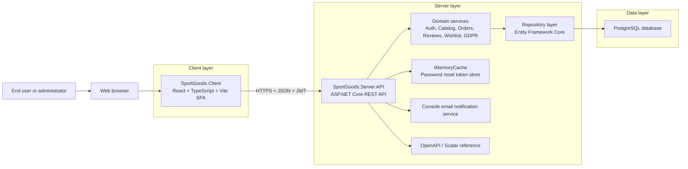
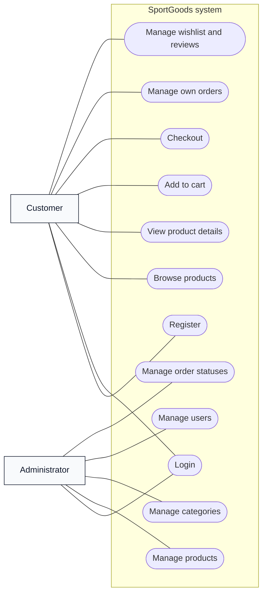
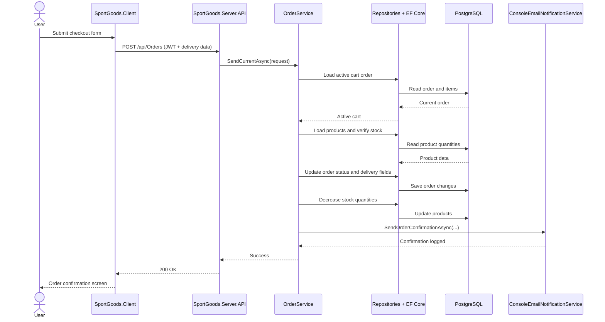
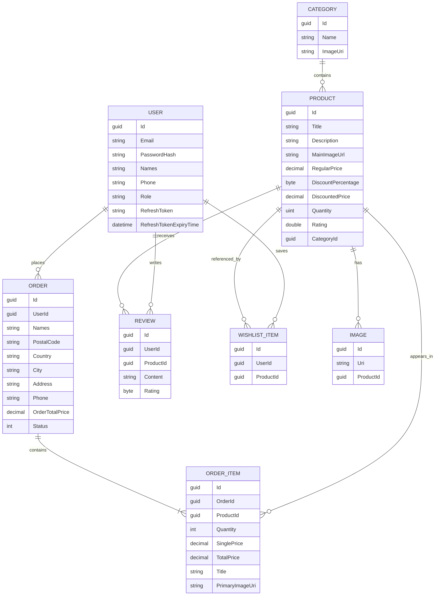

# Title Page

**Project Name:** SportGoods  
**System Type:** E-commerce system for sports goods  
**Team and Roles:**  
- Alex Ivanov — Team Lead and Backend Developer  
- Kaloyan Iliev — Frontend Developer, UI/UX Designer, and Content Creator  
**Year of Study:** 3rd year  
**Semester:** Summer semester  
**Specialty:** KST  
**Group:** 25r  
**Year:** 2026

## 1. Project Overview

SportGoods is an integrated web-based system for selling sports goods online. The platform combines a public product catalog, authenticated customer functions, checkout and order processing, and an administrative workspace for managing catalog data and users. The current implementation is split into two repositories: `SportGoods.Client`, which contains the single-page frontend application, and `SportGoods.Server`, which contains the REST API, domain logic, persistence layer, and automated backend tests.

The business problem addressed by the system is the need for a structured online channel through which sports equipment can be presented, searched, filtered, ordered, and administrated. In a traditional physical store or an unstructured catalog, customers have limited ability to compare products, review stock availability, retain selected products, and finalize an order asynchronously. SportGoods solves this by organizing products into categories, exposing detailed product pages, allowing authenticated ordering, and providing a role-based administration area for operational control.

The system serves two main user groups. The first group is end customers who browse the store, register, log in, manage personal data, add items to a cart, place orders, maintain a wishlist, and submit product reviews. The second group is administrators who maintain products, categories, users, and orders through dedicated protected screens and API endpoints. The presence of both groups is visible throughout the codebase in the use of JWT-based authentication, role checks for administrative actions, and separate frontend routes for the admin dashboard.

The main capabilities of the platform are consistent with the expected scope of an online sports store. The public area provides a home page, category browsing, product listing with filtering and pagination, and product detail pages with images and reviews. The authenticated area adds profile management, privacy-related export and deletion actions, cart handling, checkout, order history, and wishlist management. The administrative area extends the system with CRUD operations for products, categories, and users, as well as order monitoring and status changes.

In functional terms, SportGoods covers catalog presentation, customer identity management, order capture, status tracking, review management, and operational administration. The checkout flow also includes payment-method and delivery-method selection. It is important to note that the current codebase models payment as a configurable application flow rather than a live payment gateway integration. Likewise, email notifications are currently prepared through a console-based notification service rather than a production SMTP or third-party mail provider. These decisions are appropriate for a university project because they preserve the business process without introducing unnecessary external dependencies.

From a system scope perspective, the project focuses on the core workflow of a medium-complexity e-commerce application. The backend persists users, categories, products, images, reviews, orders, order items, and wishlist entries in PostgreSQL. The frontend exposes these capabilities through a React single-page application. The resulting system is sufficiently broad for academic analysis because it includes user authentication, role-based authorization, layered architecture, relational data modeling, validation, state management, and deployment preparation with Docker artifacts.

## 2. System Architecture

The architecture of SportGoods follows a clear client-server model with layered backend responsibilities. The frontend is implemented as a React and TypeScript single-page application built with Vite. The backend is implemented as an ASP.NET Core Web API that exposes REST endpoints. Persistence is handled by Entity Framework Core over a PostgreSQL database. Supporting components include JWT authentication, an in-memory password reset token store, a console-based notification service, and OpenAPI documentation through Scalar.

### 2.1 Frontend Application

`SportGoods.Client` is responsible for rendering all customer-facing and administrator-facing screens. Routing is implemented with React Router, while selected state is stored with Redux Toolkit and browser `localStorage`. The client contains pages for home, products, product details, cart, checkout, order history, wishlist, profile, login, registration, password recovery, and a dedicated admin dashboard. Styling is handled primarily through Tailwind CSS, with custom typography and color tokens defined in the project theme. Feedback to users is given through `react-toastify`, and rich-text display/editing is supported with `react-quill`.

The frontend communicates directly with the REST API by issuing `fetch` requests to the base address defined through `VITE_API_URL`. There is no separate client-side service layer abstraction at the moment; instead, page components call the backend endpoints directly. This design keeps the project easy to follow for academic purposes, although in a larger commercial system some of the request logic would typically be centralized.

### 2.2 Backend API

`SportGoods.Server` is organized into API, Domain, Data, Core, and Common projects. The API project defines controllers, middleware, service registration, and application startup. The Domain project contains business services such as `AuthService`, `ProductService`, `OrderService`, `ReviewService`, `WishlistService`, `UserService`, and `GdprService`. The Data project contains Entity Framework entities, repositories, pagination/filtering utilities, seeding logic, and the application database context. The Core project contains shared enums, paging helpers, roles, and exception types. The Common project contains request and response DTOs as well as configuration option classes.

This separation is important academically because it demonstrates a layered architecture rather than a monolithic controller-driven implementation. Controllers stay thin and delegate work to domain services. Domain services coordinate validation, repository calls, stock handling, role-sensitive behavior, and response mapping. Repositories encapsulate persistence logic and use Entity Framework Core for relational access. The result is a structure that is maintainable, testable, and easy to explain in a project defense.

### 2.3 Database and Persistence

The system uses PostgreSQL as the active database engine. This is confirmed by the Npgsql provider, the `UseNpgsql` call in `Program.cs`, and the Docker Compose configuration for a PostgreSQL 16 container. Entity Framework Core is used for migrations, database initialization, seeding, and runtime queries. The generic repository layer also implements soft deletion through the shared `IsDeleted` field that exists in `GenericEntity`.

An important modeling detail is that the project does not define a separate cart table. Instead, the active shopping cart is represented by an `Order` entity whose status is `Created`. During checkout, the same order is enriched with delivery details and moved to `PendingVerification`, after which the administrative order lifecycle can continue through `Verified`, `Processing`, `Shipped`, `Delivered`, or `Cancelled`. This is a compact and academically interesting design because it reuses one aggregate for both pre-checkout and post-checkout states.

### 2.4 Communication Between Layers

Communication from browser to frontend is standard SPA interaction. Communication from frontend to backend happens through HTTPS requests carrying JSON payloads. Protected requests add a `Bearer` access token in the `Authorization` header. On the server side, ASP.NET Core validates the JWT, dispatches the request to the appropriate controller, and the controller delegates to the domain service. Services use repositories and Entity Framework Core to query or update the database, then return DTOs that are serialized back to the frontend.

The authentication subsystem adds refresh tokens persisted on the user record, password hashing through `PasswordHasher<User>`, and a password reset flow that uses `IMemoryCache` to hold time-limited tokens. The exception middleware converts domain and runtime errors into JSON responses, which keeps the API contract predictable for the client application.

### 2.5 Deployment Components

The client repository contains a Dockerfile that builds the Vite application and serves the generated static files with Nginx. The server repository contains a Dockerfile for publishing the ASP.NET Core API and a Docker Compose file that starts both the API and PostgreSQL. Environment templates are present in both repositories. This indicates that the project is prepared for containerized deployment and reproducible local setup, even though no separate CI/CD workflow definition was detected in the workspace.

### 2.6 High-Level Architecture Diagram

The diagram shows the real core structure of the current implementation. The frontend does not access the database directly. All business behavior passes through the API and domain services, while persistence is delegated to repositories and Entity Framework Core.

## 3. UML Diagrams

The following diagrams summarize the most important user interactions implemented in the project. Because Mermaid does not provide a full native UML use case notation, the use case view is represented as a structured flowchart while preserving the meaning of actors and system functions.

### 3.1 Use Case Diagram

The diagram reflects the separation between customer and administrator behavior. Customers use the storefront and personal account functions, while administrators work with protected management endpoints and dashboard screens. Authentication is common to both roles, but authorization differentiates the allowed operations.

### 3.2 Sequence Diagram

This sequence diagram captures a typical successful purchase scenario. The real implementation checks consent, validates stock availability, updates the order status, decreases inventory, and finally triggers the configured notification service. The flow therefore covers presentation, business logic, persistence, and auxiliary services in one continuous transaction chain.

## 4. Database Design

The database model is centered on a compact but expressive set of entities that cover catalog management, shopping behavior, ordering, and customer-generated content. The system defines `User`, `Category`, `Product`, `Image`, `Order`, `OrderItem`, `Review`, and `WishlistItem`. All of these inherit from `GenericEntity`, which contributes `Id`, `CreatedOn`, `ModifiedOn`, and `IsDeleted`. This shared base is important because it standardizes identity, auditing, and soft deletion across the data model.

`Category` groups products and stores a name and image URI. `Product` is the core catalog entity and contains title, description, main image, prices, discount data, quantity, rating, and a foreign key to its category. Additional visual media are stored in `Image`, which references a product and enables galleries on the product details page. `Review` links a user to a product and stores textual content and rating, which are later aggregated to update the product rating.

Customer purchasing activity is modeled through `Order` and `OrderItem`. `Order` contains both ownership information and delivery data such as names, postal code, country, city, address, and phone. `OrderItem` stores product snapshots needed for completed ordering flows, including quantity, unit price, total price, title, and image URI. This approach reduces dependency on future product edits because an order item still retains the transactional information needed for later display.

The project also implements `WishlistItem`, which creates a many-to-many style association between users and products for saved items. Unlike orders, wishlist entries do not persist a full product snapshot because they are intended as lightweight references to current catalog items. The GDPR export service also shows that wishlist and review data are considered part of the user's personal data footprint.

One of the most important conceptual decisions in the model is the reuse of `Order` as both cart and finalized order. While the status is `Created`, the order represents the current cart. When checkout is completed, the same record becomes a formal order and advances through operational statuses. This eliminates the need for a separate cart entity and simplifies the transition from browsing to ordering without losing relational consistency.

### 4.1 E-R Diagram

The diagram corresponds to the actual backend entities and intentionally does not introduce non-existent tables such as `Cart` or `Address`. In SportGoods, cart behavior is handled by `Order`, and delivery address fields are embedded directly in the order record.

## 5. Development Stages

Based on the current repositories and their separation of concerns, the project can be reconstructed as passing through several recognizable development stages. This section describes the stages in a way suitable for academic documentation, without claiming a minute-by-minute historical timeline.

### 5.1 Requirements Analysis

The initial stage was the identification of the core processes expected from an online sports goods store: product catalog browsing, user registration and login, product details, cart creation, order placement, administrative management, and basic privacy compliance. The structure of the completed system shows that these requirements were not treated as isolated pages but as connected workflows. For example, the presence of wishlist, reviews, password reset, and GDPR export/deletion indicates that the analysis went beyond a minimal shop prototype and included customer account lifecycle concerns.

### 5.2 System Design

The next stage was the transformation of business requirements into a software design. This is visible in the explicit separation between frontend and backend repositories, the domain-driven naming of services, the request/response DTO layer, and the relational data model. The UI code also shows that the visual prototype was later refined into a more polished SPA while keeping the original system idea intact. Several client texts explicitly refer to preserving the core layout and user flow from the earlier prototype/presentation stage.

### 5.3 Architecture Definition

During the architecture stage, the project adopted a layered backend and a component-based frontend. The backend was divided into API, Domain, Data, Core, and Common projects, which is a strong educational choice because each layer has a distinct role. On the frontend, routing, page composition, reusable layout components, and isolated admin pages were defined. State concerns were split between Redux Toolkit for persistent/auth-related client state and per-page local state for view-specific data such as filters, tables, and forms.

### 5.4 Implementation

Implementation proceeded across both repositories. On the server side, developers created entities, repositories, services, controllers, startup configuration, and seeding logic. Authentication was implemented with JWT and refresh tokens, password hashing, and a password reset flow. Catalog and order services were enriched with business rules for stock validation, order status transitions, and role-sensitive access. On the client side, the team implemented the public catalog, customer account pages, checkout flow, and administrator dashboard. The admin area evolved into a multi-section management shell for overview metrics, users, categories, products, and orders.

The codebase also shows that implementation included realistic operational additions rather than only CRUD mechanics. Examples include review rating recalculation, low-stock visualization in the admin dashboard, GDPR export and anonymization, category and product imagery, password reset preview links for development, and environment-driven payment configuration.

### 5.5 Testing

The server repository contains a dedicated unit test project using xUnit, Moq, and the Entity Framework in-memory provider. Tests exist for major services and repositories such as authentication, categories, products, orders, reviews, users, and wishlist behavior. This confirms that testing was considered part of the backend development lifecycle. In contrast, the client repository includes Vitest and Testing Library dependencies and a `test` script, but no project-specific frontend tests were detected in `src`. Therefore, the current testing maturity is stronger on the backend than on the frontend.

### 5.6 Deployment Preparation

The final stage visible in the repositories is deployment preparation. Both repositories contain Docker artifacts and environment templates. The server can be started together with PostgreSQL through Docker Compose, while the client can be built into static assets and served through Nginx. This stage also includes operational configuration in `appsettings.json`, such as JWT settings, CORS origins, payment options, email behavior, low-stock thresholds, and development toggles. Even without a detected CI/CD pipeline, the project demonstrates readiness for reproducible local execution and container-based publishing.

## 6. Technologies Used

### 6.1 Backend Technologies

The backend is implemented with .NET and ASP.NET Core Web API, targeting `net10.0` in the current project files. HTTP endpoints are exposed through controller classes, while OpenAPI and Scalar provide interactive API reference output. Authentication uses `Microsoft.AspNetCore.Authentication.JwtBearer`, and password storage relies on `PasswordHasher<User>`. Authorization is role-based, with explicit checks for administrator-only actions on users, products, and categories.

Persistence is implemented with Entity Framework Core. Although some project references include SQL Server-related EF packages, the active runtime configuration clearly uses the Npgsql provider and PostgreSQL as the actual database backend. The application uses migrations, repositories, filtering models, dynamic sorting, and seeding routines. Additional backend support technologies include in-memory caching for password reset tokens and custom exception middleware for JSON error handling.

### 6.2 Frontend Technologies

The client is built with React 18, TypeScript, and Vite. Navigation is handled with React Router, and shared client state is managed with Redux Toolkit. Tailwind CSS is used for styling, supported by PostCSS and Autoprefixer. The interface also uses Heroicons for iconography, React Toastify for status messages, and React Quill where rich-text editing or display is needed. API communication is performed with the browser `fetch` API, and the base URL is provided through Vite environment variables.

From an implementation standpoint, the frontend combines global state and local component state. Authentication, cart data, and wishlist identifiers are stored in Redux and partly persisted in `localStorage`, while data grids, filter controls, and form state are managed inside page components. This hybrid approach is common in medium-sized SPA projects and is appropriate for the current system scale.

### 6.3 Docker, Tooling, and Development Support

The project includes Dockerfiles for both repositories and a Docker Compose file for the backend plus database. Backend tests are written with xUnit, Moq, and EF Core InMemory. Frontend quality tooling includes ESLint, TypeScript type checking, and Vitest configuration. The repositories also include environment templates, README files, and seed data for demonstration purposes. No CI/CD workflow definition was detected outside dependency folders, so deployment automation appears to be outside the current repository scope.

## 7. Implementation Highlights

The authentication subsystem is one of the most complete parts of the project. Registration creates customer accounts with hashed passwords and a default customer role. Login returns access and refresh tokens together with identity data used by the client. Refresh tokens are stored on the user entity, logout clears them, and protected profile endpoints allow the current user to retrieve and update personal details. The password recovery flow is also fully represented: the backend generates a temporary token, stores it in memory, and exposes a reset link preview in console-based development mode.

The product catalog is implemented as a full browsing workflow rather than a static listing. Categories are stored separately and fetched by the client to build filters and homepage navigation. Product search supports title, category, price range, minimum rating, sorting, and pagination. Product detail pages display the main image, secondary images, stock level, rich description, and customer reviews. Reviews are not decorative only; the backend recalculates the aggregate product rating after review creation or update.

Cart and checkout behavior are modeled around the order aggregate. When a user adds products, the client sends requests to the order endpoints and the backend either creates or updates the active `Created` order. The cart page then reads the current order from the server and lets the user change quantities or remove items. At checkout, the customer provides delivery information, chooses between configured payment and delivery methods, and confirms consent for personal data processing. The server validates stock, writes delivery data into the order, transitions its status, decreases inventory, and logs an order confirmation message through the notification service.

Order management is implemented for both customer and administrator views. Customers can browse their own order history with sorting and pagination and can request cancellation. Administrators can retrieve the global order list, inspect current state, and move orders through the defined lifecycle statuses. The dashboard overview additionally calculates total revenue, recent orders, and low-stock warnings, which makes the administration area more analytical and closer to a real operational workspace.

Administrative functionality also covers product, category, and user management. Products can be created and updated with descriptions, pricing, discounts, stock quantity, category assignment, and secondary images. Categories store both names and image URIs. Users can be created, edited, deleted, and promoted or demoted between customer and admin roles. These operations are protected through role-based authorization on the server and guarded routes on the client.

Another notable implementation highlight is the privacy functionality. The GDPR service can export the current user's profile, orders, wishlist references, and reviews as structured data. Account deletion is implemented as anonymization plus soft deletion rather than unsafe physical removal. This is a sound design for an academic e-commerce project because it preserves historical order integrity while reducing stored personal data.

Finally, frontend-backend communication is explicit and easy to trace. The client sends JSON requests to REST endpoints under `/api`, usually with JWT authorization headers for protected operations. The backend maps requests to DTOs, processes them in domain services, and returns typed response objects. This interaction pattern is simple, well aligned with the chosen technologies, and suitable for future extension.

## 8. Screenshots of the Finished System

The following placeholders are intentionally reserved for manual insertion of real screenshots from the running application. To remain within the assignment limit, the final exported document should keep this section within a maximum of two pages.

1. `[Insert Screenshot 1: Home page with hero section, categories, and featured products]`
2. `[Insert Screenshot 2: Product catalog with filters, pagination, and product cards]`
3. `[Insert Screenshot 3: Product details page with gallery, stock information, and reviews]`
4. `[Insert Screenshot 4: Cart and checkout flow]`
5. `[Insert Screenshot 5: Profile page with GDPR export / delete actions and order history]`
6. `[Insert Screenshot 6: Administrator dashboard with overview metrics and management screens]`
