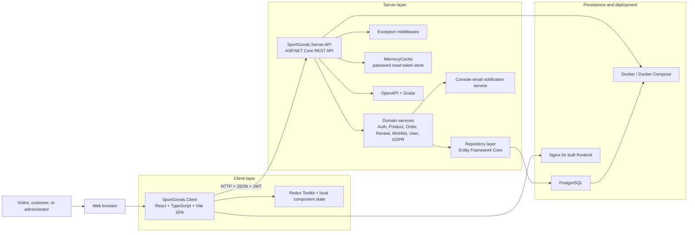
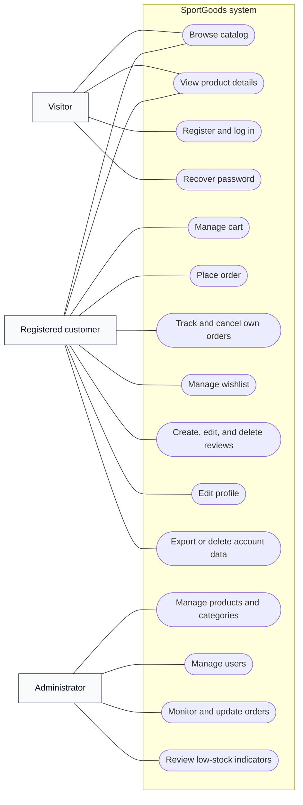
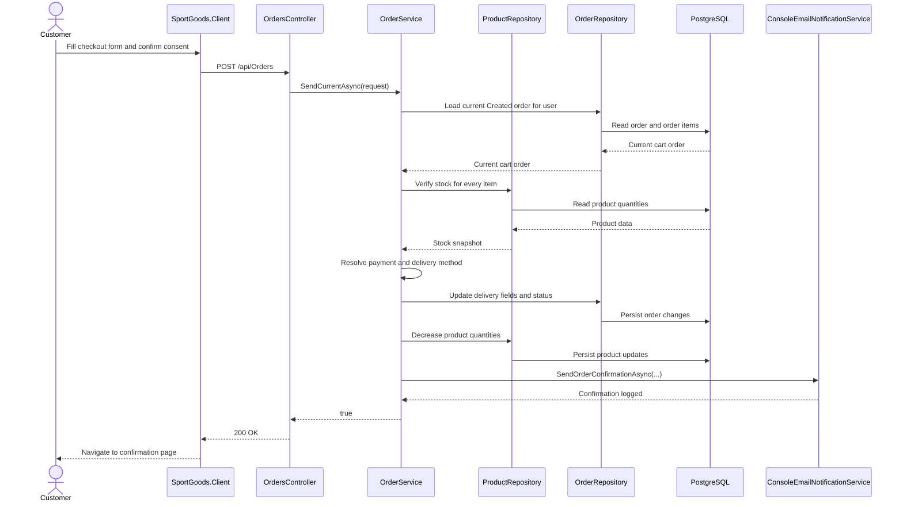
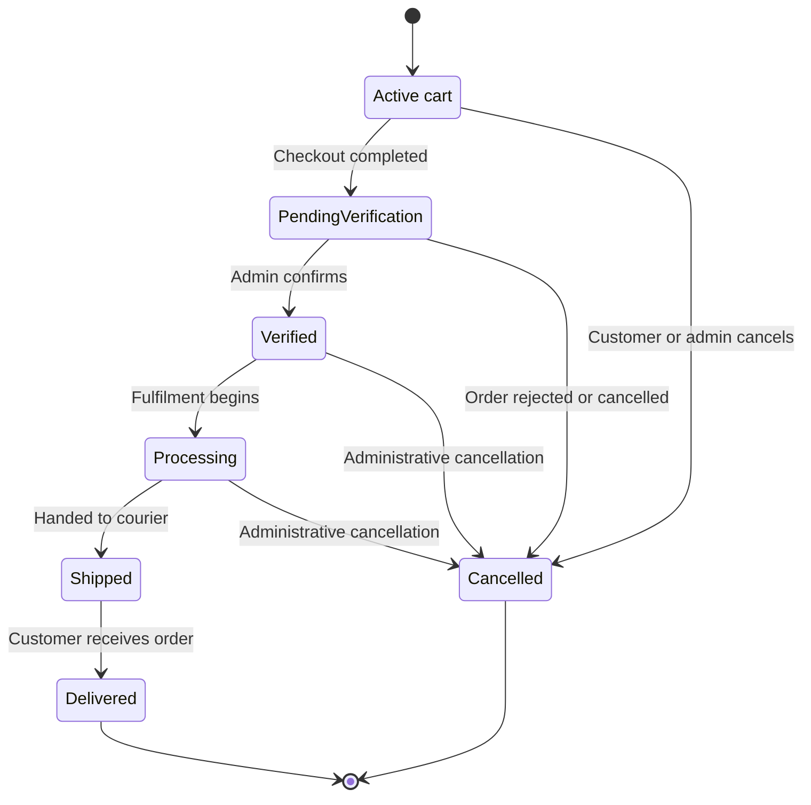
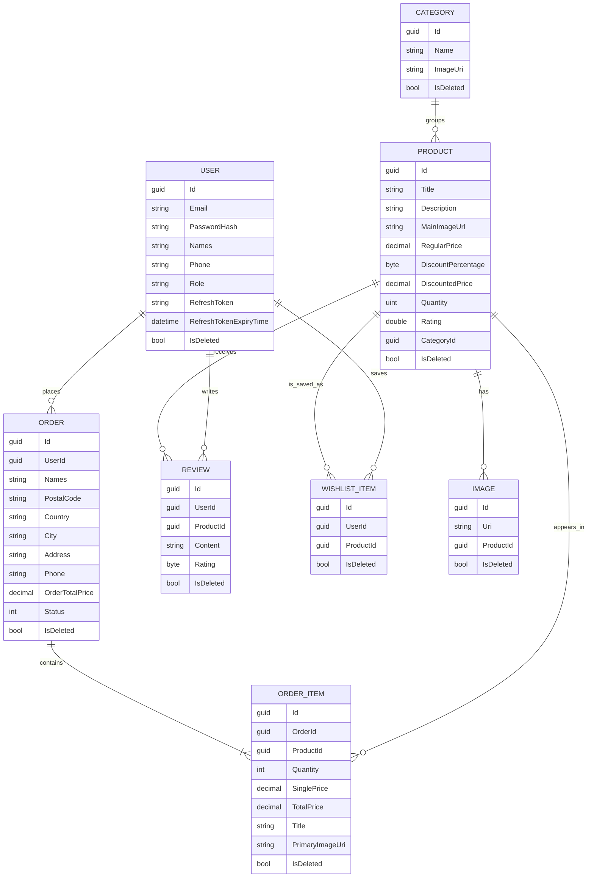

# Title Page

**Project Name:** SportGoods  
**System Type:** Web-based e-commerce system for sports goods  
**Team and Roles:**  
- Alex Ivanov, Team Lead and Backend Developer  
- Kaloyan Iliev, Frontend Developer, UI/UX Designer, and Content Creator  
**Year of Study:** 3rd year  
**Semester:** Summer semester  
**Specialty:** KST  
**Group:** 25r  
**Year:** 2026

## 1. Project Overview

SportGoods is a university software project that implements a complete online store for sports goods. The goal of the system is not only to display products, but to support the full operational cycle of a modern e-commerce platform: public catalog browsing, customer registration and login, cart handling, checkout, order tracking, product reviews, wishlist management, and administrator-side catalog and order management. The implementation is intentionally split into two repositories. `SportGoods.Client` contains the single-page frontend application, while `SportGoods.Server` contains the REST API, domain services, persistence layer, configuration, and backend tests.

The business problem addressed by the project is the need for a structured digital sales channel for sports equipment and accessories. In a traditional physical store or a simple static website, customers often cannot compare products efficiently, filter a large catalog, check stock availability, save products for later, or place orders outside working hours. SportGoods resolves these limitations by providing category navigation, detailed product pages, authenticated customer actions, and an administrative workspace for store operations.

The implemented system serves three practical user contexts. The first context is the public storefront, where visitors can open the home page, browse categories, inspect featured products, search and filter the catalog, and read detailed product information. The second context is the authenticated customer area, where registered users can maintain their profile, add items to an active cart, place an order, review past orders, save products in a wishlist, submit reviews, export their personal data, and request account deletion. The third context is the administrative workspace, where an administrator can monitor order activity, inspect low-stock products, manage products and categories, maintain user accounts, and change order statuses during processing.

From a functional perspective, the project implements the main processes that are expected from a medium-complexity online store. Products belong to categories, support discounts and secondary images, and can be filtered by title, category, price range, and minimum rating. Registered users can authenticate with JWT-based access control, recover forgotten passwords, manage profile data, and move through the order flow from draft cart to completed order. Orders are not treated as an isolated checkout form; they are a central aggregate that models both the active cart state and the post-checkout business process. This design gives the system a coherent domain model that is suitable for academic analysis.

An important part of the project is that it remains realistic without pretending to implement infrastructure that does not exist. Payment selection is modeled through configurable application options and exposed in the checkout flow, but the project does not claim a live banking or card processor integration. Likewise, order confirmations and password reset messages are handled through a console-based notification service instead of a real SMTP or third-party email provider. This is an appropriate engineering decision for a university project because it preserves the application workflow without adding external operational dependencies that are unrelated to the academic goals.

The current codebase also includes a ready-to-demo data set. The seed logic populates the database with 8 categories, 14 products, 11 users including one administrator, 12 sample orders across multiple statuses, 18 reviews, and 6 wishlist entries. This is valuable for project defense because the application can be demonstrated with realistic data rather than empty screens or placeholder-only flows.

From an academic standpoint, SportGoods is a strong study object because it combines user authentication, role-based authorization, relational data modeling, layered backend architecture, a modern SPA frontend, database migrations, automated backend testing, and containerized deployment artifacts. The project is large enough to show real software architecture decisions, but still compact enough to explain clearly during a defense.

## 2. System Architecture

SportGoods follows a client-server architecture with a clearly layered backend and a component-based frontend. The browser loads a React application, the React application communicates with an ASP.NET Core REST API over HTTP and JSON, the API delegates business behavior to domain services, and the persistence layer stores state in PostgreSQL through Entity Framework Core. This separation is visible in the repository structure, the project layout inside the server solution, and the runtime configuration loaded during application startup.

### 2.1 Repository Structure and Responsibilities

The two repositories have complementary responsibilities.

- `SportGoods.Client` contains the visual storefront and back-office interface.
- `SportGoods.Server` contains the API, domain rules, entity model, repositories, and unit tests.

The backend repository is additionally split into multiple .NET projects. `SportGoods.Server.API` contains controllers, middleware, startup logic, and infrastructure services. `SportGoods.Server.Domain` contains business services such as `AuthService`, `ProductService`, `OrderService`, `ReviewService`, `WishlistService`, `UserService`, and `GdprService`. `SportGoods.Server.Data` contains the `ApplicationDbContext`, entity classes, repositories, filtering helpers, migrations, and seeders. `SportGoods.Server.Common` contains request and response DTOs and strongly typed option classes. `SportGoods.Server.Core` contains enums, shared static values, paging helpers, and exception types. This structure demonstrates a deliberate layered design rather than a controller-heavy monolith.

### 2.2 Frontend Application

The frontend is implemented with React 18, TypeScript, and Vite. Routing is defined in `App.tsx` with `react-router-dom`, and the page structure separates public pages, authenticated customer pages, and administrator pages. The currently implemented public pages include `Home`, `Products`, `ProductDetails`, `About`, `Login`, `Register`, `ForgotPassword`, and `ResetPassword`. Authenticated customer pages include `Cart`, `Checkout`, `CheckoutConfirmation`, `Orders`, `Wishlist`, and `Profile`. Administrative functionality is grouped under `AdminPanel` and includes `AdminOverview`, `Products`, `Categories`, `Users`, and `AdminOrders`.

Styling is handled mainly through Tailwind CSS, with a consistent visual language across the storefront and the admin workspace. Notifications are shown through `react-toastify`, and rich product descriptions are edited and rendered with `react-quill`. Shared client state is managed with Redux Toolkit slices for authentication, cart information, and user-related data. Authentication state is persisted in `localStorage`, which allows the application to restore the current user session after a page refresh. At the same time, the frontend keeps the implementation approachable by relying mostly on page-level state for filters, tables, forms, and loading states.

The frontend communicates with the backend through `fetch` requests to the base URL defined by `VITE_API_URL`. There is no separate API client abstraction layer yet; the pages call the endpoints directly. For the current project size this is a reasonable tradeoff. It keeps the data flow transparent for educational purposes and makes it easier to trace how individual pages depend on specific backend endpoints.

### 2.3 Backend API and Layered Services

The backend is implemented with ASP.NET Core Web API and targets `net10.0` in the current project files. Controllers expose REST endpoints under `/api`, but they remain deliberately thin. Their primary responsibility is request binding, authorization declaration, and delegating work to the appropriate service. Examples include `AuthController`, `ProductsController`, `OrdersController`, `ReviewsController`, `WishlistController`, `CategoriesController`, `UsersController`, and `GdprController`.

The real business logic is concentrated in the domain services. `AuthService` handles registration, login, refresh tokens, logout, and password reset. `OrderService` owns cart manipulation, checkout finalization, order searching, status changes, price calculation, and stock reduction. `ProductService` handles CRUD operations, secondary images, product search, and best-seller retrieval. `ReviewService` manages review creation, update, deletion, and rating recalculation. `WishlistService` manages the saved product list for each customer. `GdprService` exports and anonymizes personal data. `UserService` handles profile updates and administrative user management. This distribution of responsibilities makes the codebase easier to test and defend because the core workflows are not hidden inside controllers.

Repositories encapsulate persistence concerns. The project contains repositories for users, categories, products, images, reviews, orders, order items, and wishlist items. These repositories operate on Entity Framework Core entities and are injected into the domain services through interfaces. The result is a classic service-plus-repository architecture that is appropriate for a teaching project focused on layered design and responsibility separation.

### 2.4 Data Persistence and Runtime Configuration

PostgreSQL is the actual runtime database engine. This is confirmed by the `UseNpgsql` registration in `Program.cs`, the Npgsql package references, and the backend `docker-compose.yml` file that starts a PostgreSQL 16 container. Entity Framework Core is used for database access, migrations, decimal precision configuration, relationship mapping, and data seeding. During startup the API resolves its connection string, applies migrations automatically, and then executes the database seeders.

Runtime behavior is controlled through strongly typed options. The backend binds sections for JWT, client URL, CORS, email behavior, payments, development settings, and inventory thresholds. This configuration is then consumed by services such as `AuthService`, `OrderService`, and the console notification service. Practical examples include the list of supported payment methods, the password reset token lifetime, the low-stock threshold used in the admin dashboard, and the optional development behavior for exposing password reset preview links.

### 2.5 Communication and Request Lifecycle

The dominant request lifecycle in the application is straightforward and easy to explain. A user performs an action in the browser, the React page sends an HTTP request with JSON data, the API authenticates and authorizes the request if needed, the controller passes the request to a domain service, the service performs validation and persistence operations through repositories, and a DTO response is returned to the frontend. Protected requests carry a `Bearer` token in the `Authorization` header. On the server side, `JwtBearer` authentication validates the token, and `[Authorize]` or `[Authorize(Roles = Roles.Admin)]` guards sensitive operations.

Error handling is centralized through a custom exception middleware. This is important for frontend integration because the client receives consistent JSON-style failure responses instead of raw framework exceptions. The API also exposes OpenAPI metadata and a Scalar API reference page, which improves inspectability during development and project defense.

### 2.6 High-Level Architecture Diagram

The architecture diagram reflects the actual implementation boundaries. The frontend never accesses the database directly. Business behavior is owned by the backend, while deployment preparation is represented through the Docker and Nginx artifacts included in the repositories.

## 3. Functional Modules and UML Diagrams

The system can be understood as a collection of cooperating modules rather than a loose set of pages. The public catalog module covers discovery and product presentation. The customer module covers authentication, cart handling, checkout, order tracking, wishlist management, review management, and profile maintenance. The administrative module covers store operations such as managing the product catalog, categories, users, and order state. A fourth cross-cutting module handles security, configuration, privacy-related export and anonymization, and operational support functions such as notifications and seed data.

### 3.1 Use Case Diagram

The use case view shows that the system is not limited to basic browsing and checkout. It also includes account lifecycle functions, privacy-related actions, and operational administration. This breadth is one of the reasons the project is suitable for academic defense.

### 3.2 Sequence Diagram for Checkout

This diagram reflects the actual checkout flow in the code. The order is loaded from the existing `Created` draft, stock is verified before the order is finalized, quantities are reduced only after validation, and the notification service is triggered last.

### 3.3 Order Status State Diagram

The state model is especially important because SportGoods intentionally reuses one `Order` aggregate both as the cart and as the final order. The `Created` state represents the draft cart, and all later states represent operational order processing.

## 4. Database Design

The database model is intentionally compact, but it covers the complete business behavior needed by the project. The main entities are `User`, `Category`, `Product`, `Image`, `Order`, `OrderItem`, `Review`, and `WishlistItem`. All of them inherit from `GenericEntity`, which contributes a generated identifier, creation and modification timestamps, and a soft-delete flag. This shared base makes the model more consistent and supports recovery-friendly deletion behavior.

`Category` represents a top-level catalog grouping and stores a name and image URI. `Product` is the central catalog entity and stores title, description, main image URL, regular price, discount percentage, discounted price, rating, quantity, and a foreign key to `Category`. Product galleries are handled through the separate `Image` entity, which points back to a product and allows multiple secondary images per item.

`User` stores the email, password hash, full name, phone number, role, refresh token, and refresh token expiry. The project does not use ASP.NET Identity tables in the full standard form; instead, it relies on the custom `User` entity together with `PasswordHasher<User>`. This makes the identity model easier to explain in an academic context while still demonstrating secure password hashing and token-based authentication.

The order model is more interesting than a standard two-table checkout form. `Order` stores both ownership data and delivery information such as names, postal code, country, city, address, phone number, total price, and status. `OrderItem` stores a product reference together with a snapshot of transactional data: quantity, single price, total price, product title, and primary image URI. The snapshot design is important because it preserves the order display information even if the product catalog changes later.

`Review` links a user to a product and stores written feedback plus a rating. `WishlistItem` links users and products in a lightweight many-to-many style table. Together with the GDPR export functionality, these entities show that the project considers user-generated content and personal data as part of the domain model, not as afterthoughts.

### 4.1 E-R Diagram

### 4.2 Data Modeling Decisions

Several data-model decisions deserve explicit explanation because they are central to the design quality of the project.

- The project does not define a separate `Cart` table. An `Order` in `Created` status acts as the active cart.
- Soft deletion is applied across the model through the shared `IsDeleted` flag, which supports safer administrative deletion and GDPR-friendly anonymization.
- `OrderItem` stores a product snapshot instead of only foreign keys and calculated values at runtime. This preserves historical consistency.
- Secondary product images are normalized into a separate table instead of being embedded in one text field.
- PostgreSQL numeric values are configured explicitly for price precision in `ApplicationDbContext`.

These decisions make the model easier to evolve and stronger from an academic software engineering perspective.

## 5. Development Stages

The exact historical commit-by-commit chronology is not the purpose of this document. However, the current repository structure and implementation clearly show a realistic development progression that can be reconstructed and defended.

### 5.1 Planning and Scope Definition

The first stage was the selection of a domain that is familiar, demonstrable, and rich enough for layered implementation. Sports goods e-commerce is suitable because it includes catalog management, user accounts, transactional flows, and administrator operations. At this stage the team needed to decide what belonged inside the project scope and what would stay outside it. The implemented result shows a deliberate choice to cover the complete internal store workflow while leaving out external integrations such as production payment gateways and live email delivery.

### 5.2 Requirements Analysis

The requirements stage focused on identifying the essential user journeys. For customers these journeys were browsing, product inspection, registration, login, password recovery, cart handling, checkout, order history, wishlist behavior, reviews, and profile maintenance. For administrators they were product, category, user, and order management. A second category of requirements concerned security and compliance, including password hashing, JWT-based access control, consent during checkout, personal data export, and account anonymization. The current codebase demonstrates that these concerns were treated as system requirements from the beginning and not added at the last moment.

### 5.3 UI, Data, and Architecture Design

Once the requirements were defined, they were translated into a software structure. This is visible in the two-repository setup, the multi-project backend solution, the entity relationships, and the page structure of the frontend. The team designed separate layers for controllers, services, repositories, DTOs, and entities. On the frontend, the pages were organized into public, customer, and administrator routes. The data model was designed around categories, products, images, users, reviews, orders, and wishlist entries, with `Order` intentionally reused as the cart aggregate.

### 5.4 Implementation

Implementation took place in parallel across both repositories. On the server side, the team created entities, repositories, controllers, services, configuration classes, middleware, migrations, and seeders. On the client side, the team implemented the storefront, the product listing and detail pages, the cart and checkout flow, customer account screens, and the administrative workspace. Evidence of gradual refinement can be seen in the range of implemented features: not just CRUD operations, but also rating recalculation, low-stock warnings, password reset preview links, seeded sample orders, and GDPR data export.

### 5.5 Testing and Correction

Testing is strongest on the backend. The solution contains a dedicated unit test project with xUnit, Moq, and the EF Core InMemory provider. The current repository contains 113 backend tests that cover configuration validation, repositories, and service behavior for authentication, categories, products, reviews, orders, users, and wishlist handling. This indicates that testing was treated as a real engineering activity rather than a symbolic final step. On the frontend side, the project includes Vitest and Testing Library configuration, but no project-specific frontend tests were found in `src`. This should be acknowledged honestly during defense as an area for further improvement.

### 5.6 Deployment Preparation and Documentation

The final stage visible in the repositories is preparation for reproducible execution and submission. Both repositories contain Docker artifacts. The backend can run together with PostgreSQL through Docker Compose, and the frontend can be built and served through Nginx. The API applies migrations on startup and seeds the database automatically, which reduces manual setup steps before demonstration. The present documentation and defense materials belong to this stage as well, because academic completion requires not only code, but also a structured explanation of the architecture, technologies, workflows, and limitations.

## 6. Technologies Used

### 6.1 Backend Technologies and Rationale

The backend is built with .NET and ASP.NET Core Web API. This stack was chosen because it offers a mature framework for REST APIs, dependency injection, authentication, middleware, and configuration binding. For a university project it is especially appropriate because it supports clean separation between controllers, services, and repositories while also being widely used in enterprise software.

Entity Framework Core is used as the persistence technology. It provides database migrations, LINQ-based querying, relationship mapping, and seed initialization. In this project it reduces boilerplate and allows the team to focus on business rules rather than low-level SQL plumbing. PostgreSQL is the selected database engine. It fits the project well because it is stable, open-source, and well supported through Npgsql. The choice is justified not only technically, but also educationally, since it exposes students to a real relational database workflow.

Authentication is implemented through `Microsoft.AspNetCore.Authentication.JwtBearer`, refresh tokens, and `PasswordHasher<User>`. This combination allows the project to demonstrate secure password storage and stateless API protection. Scalar and OpenAPI are used for inspectable API documentation. `IMemoryCache` is used for temporary password reset tokens, and the project also includes custom middleware for centralized exception handling.

### 6.2 Frontend Technologies and Rationale

The frontend uses React 18 with TypeScript and Vite. React is appropriate for the project because the application has many reusable UI elements, multiple views, and client-side state transitions. TypeScript adds stronger type safety for API responses, component props, and state models. Vite provides a fast local development loop and a straightforward production build pipeline, which is especially useful in a student project that is iterated on frequently.

Routing is handled by `react-router-dom`, which fits the SPA model and supports clear separation between public and protected pages. Redux Toolkit is used for shared state such as authentication, cart information, and user-related data. Tailwind CSS is used for styling because it makes it possible to build a complete responsive UI without a large custom CSS codebase. `react-toastify` provides visible feedback for operations such as adding products to the cart or handling failures. `react-quill` is used where rich product descriptions are edited or rendered. Together, these technologies create a modern but still understandable frontend stack.

### 6.3 Database, Deployment, and Environment Management

PostgreSQL is the active database, while Docker and Docker Compose are used to make the project easier to run locally and more reproducible for defense. The backend Docker Compose setup defines both the API and the database, while the frontend has its own Dockerfile and a lightweight Docker Compose configuration for serving the built application. Nginx is used to serve the production frontend bundle. Environment values are separated into `.env.example` files and `appsettings` sections, which is a good practice even in an academic setting because it avoids hard-coding environment-dependent configuration directly in the source.

### 6.4 Development and Quality Tools

Backend quality support includes xUnit, Moq, and EF Core InMemory for unit testing. Frontend quality support includes ESLint, TypeScript type checking, and Vitest configuration. Git is used for version control, and the project structure suggests team-based collaboration with clear repository responsibilities. These tools were chosen not as decoration, but because they support maintainability, correctness, and predictable project delivery.

## 7. Quality, Security, and Readiness for Demonstration

### 7.1 Authentication and Authorization

The system implements multiple layers of access control. Passwords are hashed, JWT access tokens secure protected endpoints, refresh tokens allow session renewal, and role-based authorization restricts administrative operations. On the frontend, customer-only pages are protected through `PrivateRoute`, and the admin workspace checks the current user role before rendering. On the backend, administrator endpoints are explicitly guarded with role constraints. This combination is important because it shows that the project does not rely solely on client-side hiding of buttons or routes.

### 7.2 Validation, Exception Handling, and Data Safety

Request DTOs define the input contract for operations such as checkout, status changes, and product management. Business services perform additional checks, for example verifying stock before confirming an order, preventing duplicate wishlist entries, and recalculating ratings after review changes. A custom exception middleware converts service-level failures into predictable API responses. Account deletion is handled as anonymization plus soft deletion, which preserves order history while reducing personal data retention. This is a defensible design choice for an e-commerce domain.

### 7.3 Testing Status

The backend test suite currently contains 113 automated tests distributed across configuration, repositories, and services. This gives the project measurable engineering depth beyond UI screenshots and manual clicking. The tests are especially valuable around authentication, repository behavior, and order logic, where regressions would affect the most critical workflows. The honest limitation is that the frontend currently has configured test tooling but not implemented project-specific automated tests. This does not invalidate the project, but it should be presented as the next quality improvement step rather than hidden.

### 7.4 Demonstration Readiness

The project is well prepared for a defense demonstration. The API applies migrations automatically, the seeders populate realistic catalog and order data, the admin dashboard shows meaningful metrics, and the public storefront is visually complete enough for live navigation. The data set includes low-stock cases, different order statuses, multiple categories, customer reviews, and privacy-related functionality. This allows the team to demonstrate both happy-path use cases and system depth within a short presentation slot.

## 8. Screenshots of the Finished Solution

To stay within the academic limit of approximately two pages, this document should contain no more than four final figures. The recommended approach is a 2x2 layout with concise captions. If more interface states must be shown, combine related views into a single collage figure instead of adding more pages.

1. `[Figure 1 placeholder: Home page with hero section, category entry points, and featured products]`
2. `[Figure 2 placeholder: Product catalog with filters, pagination, and product cards]`
3. `[Figure 3 placeholder: Product details page or checkout flow showing cart-to-order transition]`
4. `[Figure 4 placeholder: Admin workspace with overview metrics, low-stock section, and order management]`

If space permits, the profile and GDPR actions can be shown inside Figure 3 or Figure 4 as a combined collage rather than as a separate fifth screenshot.

## 9. Presentation and Defense Structure

The project should be defended through a short, technical, and logically ordered presentation. A practical ten-slide structure is recommended.

1. **Slide 1, Title and team:** Introduce the project, the team members, and the two-repository structure. State that SportGoods is an online store for sports goods with customer and admin functionality.
2. **Slide 2, Problem and motivation:** Explain why a structured online sales channel is needed and what limitations exist in a non-digital or weakly structured store process.
3. **Slide 3, Target users and implemented scope:** Present the three user contexts: visitor, registered customer, and administrator. Summarize the implemented modules.
4. **Slide 4, System architecture:** Show the client-server diagram and explain the split between React frontend, ASP.NET Core API, domain services, repositories, and PostgreSQL.
5. **Slide 5, Database model:** Show the E-R diagram and explain the core entities. Highlight the design decision that an `Order` in `Created` status acts as the active cart.
6. **Slide 6, Main workflow:** Use the sequence or state diagram to explain the checkout and order lifecycle from cart creation to delivery or cancellation.
7. **Slide 7, Technologies and rationale:** Explain why React, TypeScript, ASP.NET Core, EF Core, PostgreSQL, Docker, and automated tests were chosen.
8. **Slide 8, Live demo:** Demonstrate one complete flow such as home page to product details to cart to checkout confirmation, then switch to the admin dashboard and show order status management.
9. **Slide 9, Quality, security, and limitations:** Mention JWT authentication, role checks, backend tests, GDPR export and anonymization, and also state the current limitations honestly.
10. **Slide 10, Conclusion:** Summarize what was achieved, why the architecture is appropriate, and what the next engineering steps would be.

For extended slide-by-slide speaker notes, see the dedicated file `docs/DefensePresentation.en.md`.

## 10. Current Limitations and Future Development

The project is complete enough for academic submission, but it is not presented as a finished commercial product. Several limitations are visible in the real implementation and should be stated clearly.

- Payment is modeled as a configurable application flow, not as a live external gateway integration.
- Email delivery is implemented through a console service, not through SMTP or a cloud mail provider.
- Frontend automated tests are not yet implemented, even though the toolchain is prepared.
- The repositories do not currently include a CI/CD workflow definition.
- Product and category images are referenced by URI rather than uploaded into dedicated file storage.

These limitations also define the most realistic next steps for future development. The first improvement would be to add frontend tests for the critical pages and flows. The second would be to integrate a real email provider and a production payment service. The third would be to add CI/CD automation and environment-specific deployment profiles. A fourth improvement would be centralized frontend API utilities and token refresh handling to reduce repeated fetch logic across pages.

## 11. Conclusion

SportGoods satisfies the requirements of a substantial academic software project. It provides a realistic domain, a layered architecture, a relational database model, protected customer and admin functionality, automated backend testing, and deployment preparation through Docker. Just as importantly, it does not overstate what is implemented. The documentation reflects the real structure of the codebase and can be defended as an honest engineering description of the current system.
